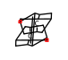

# v6 논문·반응 정리집

# 유기화학 논문·반응 정리집

Klein 유기화학 1~23장 인용 문헌 · 기출 출제 경향 · 노벨상 연계

## Ⅰ. 기출 출제 경향 분석 (2014~2026학년도 유기화학 66문항)

### 1. 영역별 출제 빈도

카보닐 α-탄소·축합 반응

14

분광학적 구조 결정(IR·NMR·MS)

13

방향족 치환·다이아조늄 화학

12

입체화학·형태 분석

10

작용기 변환·친핵성 반응 메커니즘

9

고리화 첨가·자리옮김·방향족성

6

유기 산·염기

2

| 영역 | 2014–2017 | 2018–2021 | 2022–2026 | 2점 | 4점 | 합계 | 중요도 |
| --- | --- | --- | --- | --- | --- | --- | --- |
| 카보닐 α-탄소·축합 반응 | 4 | 3 | 7 | 3 | 11 | **14** | ★★★ |
| 분광학적 구조 결정(IR·NMR·MS) | 4 | 4 | 5 | 13 | 0 | **13** | ★★★ |
| 방향족 치환·다이아조늄 화학 | 3 | 3 | 6 | 3 | 9 | **12** | ★★★ |
| 입체화학·형태 분석 | 4 | 2 | 4 | 6 | 4 | **10** | ★★★ |
| 작용기 변환·친핵성 반응 메커니즘 | 3 | 5 | 1 | 5 | 4 | **9** | ★★ |
| 고리화 첨가·자리옮김·방향족성 | 2 | 2 | 2 | 2 | 4 | **6** | ★★ |
| 유기 산·염기 | 0 | 1 | 1 | 2 | 0 | **2** | ★ |

· 2점(기입형)은 분광 구조 결정과 짧은 입체화학, 4점(서술형)은 카보닐 축합·방향족 다단계 합성 + 굽은 화살표 메커니즘이 주류이다.  
· 최근(2022~2026) 경향: ① 다단계 합성에서 중간체 분자식 제시 → 구조 추론, ② 고리 형성 단계(Robinson, Dieckmann, 분자 내 알돌, Claisen 자리옮김) 메커니즘 요구, ③ 입체특이성(Wittig→에폭시화, 동역학적 분할·ee), ④ 방향족성·FMO와 결합한 고리화 첨가.

### 2. 핵심 반응 우선순위 (출제 빈도·최신성 기준)

| 순위 | 핵심 반응/개념 | 대표 기출 |
| --- | --- | --- |
| 1 | 엔올레이트 축합: 알돌·Claisen·Dieckmann·Michael·Robinson 고리 형성, 말론산/아세토아세트산 에스터 합성, 탈카복실화 | 2026A-11, 2025A-11, 2024B-7, 2023A-10, 2023B-7, 2022B-9 |
| 2 | 방향족: EAS 배향·속도, SNAr(Meisenheimer), 벤자인, 다이아조늄(Sandmeyer, 짝지음, 페놀화), Hofmann 자리옮김 | 2026A-10, 2025A-10, 2024A-10/11, 2023A-2, 2022B-8 |
| 3 | 분광: IR 카보닐·OH, ¹H NMR 이동·갈라짐·J, ¹³C/DEPT, MS 동위원소·McLafferty | 매년 1~2문항 |
| 4 | 입체화학: anti/syn 첨가 → meso/라셈, E2 trans-diaxial, 에폭사이드 열림, 동역학적 분할·ee, A값 | 2026A-1, 2024B-2, 2023B-2, 2021B-8, 2017A-13 |
| 5 | 고리화 첨가·자리옮김: Diels–Alder(endo, 위치), Claisen/Cope, 방향족성(Hückel) | 2025B-7, 2024A-11, 2020B-7, 2019B-4, 2022A-2 |
| 6 | 작용기 변환: Grignard/큐프레이트(1,2 vs 1,4), 알카인 수화, 라디칼 첨가, 아실 치환 메커니즘(¹⁸O), 인접기 관여 | 2026B-7, 2021B-9, 2020B-8, 2017A-4 |

### 3. 노벨 화학상과 유기화학 출제 포인트

| 연도 | 수상자 | 주제 | 임용 연계 포인트 |
| --- | --- | --- | --- |
| 2025 | Kitagawa · Robson · Yaghi | 금속–유기 골격체(MOF) | 배위 결합 기반 다공성 골격 — 착화합물·무기 영역과 연계 |
| 2022 | Bertozzi · Meldal · Sharpless | 클릭 화학·생체직교 화학 | CuAAC(1,4-트라이아졸), 변형 촉진 SPAAC, 알카인 꼬리표 아미노산 |
| 2021 | List · MacMillan | 비대칭 유기촉매 | 프롤린 엔아민 촉매(알돌·Robinson/Hajos–Parrish), 이미늄 촉매 Diels–Alder, ee 계산 |
| 2010 | Heck · Negishi · Suzuki | Pd 촉매 교차 짝지음 | 산화적 첨가–금속 교환–환원적 제거, 아릴 할라이드·다이아조늄 활용 |
| 2005 | Chauvin · Grubbs · Schrock | 올레핀 복분해 | 금속 카벤, 고리 닫음 복분해(RCM) |
| 2001 | Knowles · Noyori · Sharpless | 키랄 촉매 수소화·산화 | Sharpless 비대칭 에폭시화(DET), BINAP–Ru 수소화 |
| 1994 | Olah | 탄소 양이온 화학 | 초강산·초친전자체, 탄소 양이온 자리옮김 |
| 1990 | Corey | 역합성 분석 | 합성 설계(신톤), 보호기 전략 |
| 1981 | Fukui · Hoffmann | 프런티어 오비탈·궤도 대칭 | HOMO–LUMO, Diels–Alder 위치/endo 선택성, 전자고리화 |
| 1979 | Brown · Wittig | 수소화붕소화 · Wittig 반응 | anti-Markovnikov syn 첨가, oxaphosphetane, 알켄 기하 |
| 1969 | Barton · Hassel | 형태 분석 | 의자 형태·A값·축/적도 반응성(E2 trans-diaxial) |
| 1950 | Diels · Alder | Diels–Alder 반응 | [4+2] 협동 고리화 첨가, endo 규칙 |
| 1912 | Grignard · Sabatier | Grignard 시약 · 촉매 수소화 | 탄소 친핵체의 카보닐 첨가 |

## Ⅱ. 교재(Klein 유기화학) 인용 논문 · 반응 정리 — 총 233편

각 장 끝 「참고문헌」에 실린 논문과, 그 논문을 소재로 한 도전·종합 문제의 반응을 정리했다. 중요도는 임용 출제 관점(★★★ 빈출 핵심)이다. 구조식은 RDKit으로 생성·검증하였다.

| 장 | 제목 | 논문 수 | ★★★ |
| --- | --- | --- | --- |
| 1장 | 일반화학 복습하기 | 9 | 0 |
| 2장 | 분자 표현법 | 14 | 0 |
| 3장 | 산과 염기 | 11 | 6 |
| 4장 | 알케인과 사이클로알케인 | 9 | 0 |
| 5장 | 입체이성질현상 | 9 | 2 |
| 6장 | 화학반응성과 메커니즘 | 10 | 3 |
| 7장 | 치환 반응 | 12 | 7 |
| 8장 | 알켄: 구조 및 제거 반응을 이용한 제법 | 8 | 4 |
| 9장 | 알켄의 첨가 반응 | 10 | 8 |
| 10장 | 알카인 | 10 | 3 |
| 11장 | 라디칼 반응 | 10 | 3 |
| 12장 | 합성 | 10 | 8 |
| 13장 | 알코올과 페놀 | 10 | 3 |
| 14장 | 에터와 에폭사이드; 싸이올과 설파이드 | 11 | 3 |
| 15장 | 적외선 분광법과 질량 분석법 | 10 | 2 |
| 16장 | 핵자기공명 분광법 | 7 | 1 |
| 17장 | 콘쥬게이션 파이계와 페리고리 협동반응 | 10 | 4 |
| 18장 | 방향족 화합물 | 10 | 3 |
| 19장 | 방향족 치환반응 | 10 | 3 |
| 20장 | 알데하이드와 케톤 | 12 | 4 |
| 21장 | 카복실산과 그 유도체 | 10 | 4 |
| 22장 | 알파 탄소 화학: 엔올과 엔올 음이온 | 11 | 3 |
| 23장 | 아민 | 10 | 3 |

## 제1장 일반화학 복습하기

- 원자 오비탈·전자 배치: Aufbau, Pauli 배타 원리, Hund 규칙
- 원자가 결합 이론(σ 결합 = 결합축 위 겹침)과 분자 오비탈 이론(LCAO, HOMO/LUMO)
- 혼성화: sp³(정사면체 109.5°) → sp²(평면 삼각 120°, σ+π) → sp(선형 180°, σ+2π)
- VSEPR: 입체수 = σ 결합 수 + 비공유 전자쌍 수 → 분자 기하 예측
- 결합·분자 쌍극자 모멘트(벡터 합)와 극성
- 분자 간 힘: 쌍극자–쌍극자 < 수소 결합, London 분산력(표면적↑ → 끓는점↑, 가지↑ → 끓는점↓)
- 용해도: 끼리끼리 녹는다, 비누 = 양친매성 → 마이셀

문제 1.68 · tert-butyl isocyanide → isocyanide dichloride중요도 ★★☆

문헌Tetrahedron Lett. 2012, 53, 4536–4537

반응tert-뷰틸 아이소사이아나이드(A, R–N⁺≡C⁻) → (Cl₂) → 아이소사이아나이드 이염화물(B, R–N=CCl₂)로 바꿔 아이소나이트릴 반응성을 일시적으로 차폐

개념혼성화·결합각: A의 N·C는 sp(C–N–C 약 180°, C 비공유쌍은 sp 오비탈), B의 N·C는 sp²(약 120°보다 약간 작음)

A

Cl₂

B

문제 1.69 · dihydromyrcene (3,7-dimethylocta-1,6-diene)중요도 ★☆☆

문헌Org. Lett. 1999, 1, 1123–1125

반응두 π 결합 중 입체 장애가 적은 말단 일치환 C=C에 선택적 시약이 먼저 반응

개념입체 장애: 삼치환 C=C가 더 혼잡 → 반응 느림(입체 장애 ≠ 입체수)

dihydromyrcene

문제 1.71 · [¹⁸F]fluoroethylcholine (PET 추적자)중요도 ★☆☆

문헌Tetrahedron Lett. 2003, 44, 9165–9167

반응¹⁸F–CH₂CH₂Br + Me₂NCH₂CH₂OH → (N-알킬화, SN2) → 4차 암모늄 브로민화물

개념헤테로원자 혼성화(F, Br, N 모두 sp³), C–N–C 약 109.5°

출발물

Me₂NCH₂CH₂OH

[¹⁸F]플루오로에틸콜린

문제 1.72 · epichlorohydrin + phenol → phenyl glycidyl ether중요도 ★★☆

문헌Tetrahedron 2006, 62, 10968–10979

반응에피클로로하이드린 + 페놀, NaOH, 가열 → 클로로하이드린 3 + 페닐 글리시딜 에터 4; 가열(증류) 시 쉽게 분리

개념수소 결합과 끓는점: O–H 있는 3이 끓는점 훨씬 높음

에피클로로하이드린

PhOH, NaOH, 가열

생성물 3

생성물 4

문제 1.73 · phenalamide A2 (보론산 에스터 중간체)중요도 ★☆☆

문헌Org. Lett. 1999, 1, 1713–1715

반응Phenalamide A2 전합성에 쓰인 알릴 피나콜 보로네이트의 구조 분석

개념B는 sp²(빈 p 오비탈), 예상 O–B–O 120°지만 5원 고리 때문에 약 110°

문제 1.74 · benzonitrile oxide (옥사졸리디논 합성)중요도 ★★☆

문헌J. Org. Chem. 2009, 74, 1099–1113

반응하이드록시모일 염화물 PhC(Cl)=NOH → (−HCl) → 나이트릴 옥사이드 PhC≡N⁺–O⁻

개념형식 전하(N +1, O −1), 극성 용매 용해도, C–C–N 결합각 120° → 180°

1

염기 (−HCl)

나이트릴 옥사이드 2

문제 1.75 · estradiol 17α-엔아인–알렌 유도체 (유방암 치료 후보)중요도 ★★☆

문헌Tetrahedron Lett. 2001, 42, 8579–8582

반응에스트라다이올 C17에 C≡C–CH=CH–CH=C=CH₂ 사슬을 단 화합물의 알렌 부분 구조 분석

개념알렌: 말단 C sp², 중앙 C sp(180°), 두 π 결합(및 말단 치환기 평면)이 서로 수직

문제 1.76 · Boc-Leu-NH-iPr (효소 모방 폴다머)중요도 ★☆☆

문헌Org. Lett. 2001, 3, 3843–3846

반응Boc 카바메이트 C=O와 아이소프로필아마이드 N–H가 가까이 위치

개념분자 내 수소 결합(7원 고리, γ-turn)

Boc-Leu-NH-iPr

문제 1.77 · bisphenol A / 4,4′-methylenedianiline (분자 각인 고분자)중요도 ★★☆

문헌J. Am. Chem. Soc. 2009, 131, 8833–8838

반응COOH 결합 자리(A)는 페놀·아닐린 모두 결합, 피리딘 결합 자리(B)는 비스페놀 A만 강하게 결합

개념수소 결합 주개/받개 상보성: 피리딘 N(받개 전용)은 더 산성인 페놀 O–H와 선택적으로 결합

노벨상1987 (Cram·Lehn·Pedersen, 초분자·호스트–게스트 화학)

비스페놀 A

## 제2장 분자 표현법

- Lewis 구조 → 부분 축약·축약 구조 → 선-결합 구조(C, H 생략)
- 작용기가 반응성을 결정, 형식 전하와 숨은 비공유 전자쌍 찾기
- 쐐기/점선, Fischer·Haworth 투영으로 3차원 표현
- 공명: 굽은 화살표 규칙(단일 결합 끊지 않기, 2주기 원소 옥텟 초과 금지)
- 공명 5유형: 알릴 비공유쌍, 알릴 양이온, C⁺ 옆 비공유쌍, 전기음성도 다른 원자 간 π 결합, 고리 내 콘쥬게이션 π
- 기여도 규칙: 옥텟 충족 > 형식 전하 최소 > 음전하는 전기음성 원자에
- 비편재 비공유쌍은 p 오비탈(원자 sp²), 아마이드 C–N 회전 제한

문제 (본문 인용) · 중요도 ★☆☆

문헌Org. Biomol. Chem. 2015, 13, 7813–7821

반응각주 1: 연습 문제에서 표시를 찾지 못함(본문 인용으로 추정)

개념

문제 2.68 · (+)-dragmacidin D (해면 알칼로이드)중요도 ★★☆

문헌Org. Lett. 2015, 17, 1529–1532

반응2-아미노이미다졸륨 양이온의 전하 비편재화

개념구아니디늄형 공명: + 전하가 세 N에 분산, 공명 혼성체(δ+)

문제 2.69 · CL-20 / HMX 공결정 (고에너지 물질)중요도 ★☆☆

문헌Cryst. Growth Des. 2012, 12, 4311–4314

반응CL-20 : HMX = 2 : 1 공결정, 분자식 계산과 고리 N 비공유쌍 분석

개념나이트라민 N–NO₂ 공명: 고리 N 비공유쌍은 비편재(sp², 평면)

HMX

문제 2.70 · progesterone (W. S. Johnson 생체모방 폴리엔 고리화)중요도 ★★☆

문헌J. Am. Chem. Soc. 1971, 93, 4332–4334

반응폴리엔 고리화 중간체의 1,3-다이옥솔란-2-일륨(옥소카베늄) 양이온 안정성

개념양이온 옆 산소 비공유쌍 공명(옥소카베늄), 모든 원자 옥텟 충족

노벨상1994 (G. A. Olah, 탄소 양이온 화학)

문제 2.71 · cholesterol, porritoxin (구조 수정 사례)중요도 ★☆☆

문헌Angew. Chem. Int. Ed. 2005, 44, 1012–1044

반응잘못 제안된 천연물 구조와 수정된 구조의 작용기 비교

개념작용기 식별: 2차 알코올·알켄(콜레스테롤), 락탐·에터·1차 알코올(porritoxin)

콜레스테롤(올바른 구조)

문제 2.72 · malachite green 등 트라이아릴메테인 염료중요도 ★★☆

문헌Chem. Rev. 1993, 93, 381–433

반응Basic green 4(말라카이트 그린)·basic violet 4(에틸 바이올렛) 양이온의 공명

개념+ 전하가 N 두 개·중심 C·고리 o/p 위치에 비편재; NR₂가 셋인 basic violet 4가 더 안정

말라카이트 그린

문제 2.73 · poly(vinyl acetate) → poly(vinyl alcohol)중요도 ★★☆

문헌J. Chem. Ed. 2006, 83, 1534–1536

반응아세트산 바이닐 중합 → PVAc → NaOH/H₂O 완전 가수분해 → PVA

개념IR: 에스터 C=O(약 1740 cm⁻¹)·C–O(1240) 소멸, 넓은 O–H(3200–3500) 증가

아세트산 바이닐

문제 2.74 · 3-acetyl-7-(diethylamino)coumarin중요도 ★★☆

문헌J. Chem. Ed. 2006, 83, 287–289

반응4-(다이에틸아미노)살리실알데하이드 + 아세토아세트산 에틸, 피페리딘 → Knoevenagel 축합 후 락톤화 → 쿠마린

개념IR로 반응 확인: 페놀 O–H·알데하이드 C–H(2720/2820) 소멸, 락톤 C=O(약 1730) 생성

1

CH₃COCH₂CO₂Et, 피페리딘

쿠마린 2

문제 2.75 · 트리스(도데실옥시)벤질 4-폼일벤즈아마이드 (젤화제 중간체)중요도 ★★☆

문헌Soft Matter 2012, 8, 5486–5492

반응젤화제 중간체의 작용기 확인과 C–N 결합 회전

개념아마이드 C(=O)–N 부분 이중 결합성(공명) → 회전 제한, 벤질 CH₂–N은 자유 회전

문제 2.76 · 피리디늄 알데하이드 + 다이아민 비스-이민중요도 ★☆☆

문헌Langmuir 2012, 28, 14567–14572

반응RCHO + R′NH₂ → RCH=NR′ (2 : 1 축합으로 비스-이민)

개념이민 형성, 3,5- vs 3,4-치환 생성물은 구조 이성질체

카다베린 B

p-자일릴렌다이아민 C

문제 2.77 · Pro-Val 볼라 양친매성 젤화제중요도 ★☆☆

문헌J. Am. Chem. Soc. 2009, 131, 11478–11484

반응아마이드 N–H와 아민 N–H의 수소 결합 주개 능력 비교, 분자 간 수소 결합 적층

개념아마이드 공명(N⁺=C–O⁻)으로 N–H가 더 극성 → 강한 주개

문제 2.78 · tropolone중요도 ★★☆

문헌J. Org. Chem. 1997, 62, 3200–3207

반응트로폴론은 산(→ 트로폴론산 음이온)이자 염기(→ 1,2-다이하이드록시트로필륨)

개념비편재화로 방향족(6π 트로필륨) 성격, C–C 결합 길이 균등화

트로폴론

염기

트로폴론산 음이온

문제 2.79 · rhodamine 6G (Basic red 1)중요도 ★★☆

문헌Chem. Rev. 1993, 93, 381–433

반응잔텐 양이온 염료에서 공명에 참여하지 못하는 고리 찾기

개념2-(에톡시카보닐)페닐 고리는 입체 장애로 잔텐 평면과 수직 → p 오비탈 겹침 불가

로다민 6G

문제 2.80 · tofacitinib (JAK 억제제)중요도 ★☆☆

문헌J. Invest. Dermatol. 2014, 134, 2988–2990

반응선-결합 구조에서 각 탄소의 숨은 H 개수 세기 (C₁₆H₂₀N₆O)

개념선-결합 구조 해석, 분자식

tofacitinib (3R,4R)

## 제3장 산과 염기

- Brønsted–Lowry 산·염기, 양성자 전달은 굽은 화살표 2개 이상
- pKa로 평형 판단: 평형은 더 약한 산(pKa 큰 쪽) 방향으로 이동
- 짝염기 안정성 ARIO: 원자(전기음성도·크기) > 공명 > 유발 효과 > 오비탈(sp > sp² > sp³)
- 평준화 효과: 용매의 짝염기보다 강한 염기는 존재할 수 없음 (H₂O 대신 NaNH₂·LDA 등)
- 용매화 효과·짝이온 효과로 pKa 차이 설명
- Lewis 산(전자쌍 받개)·Lewis 염기(전자쌍 주개), 예: BH₃·THF, AlCl₃–카보닐 착물
- 보호기 도입 마지막 단계(MOMCl/DIPEA, TMSCl/2,6-lutidine, TBSCl/imidazole)는 옥소늄 탈양성자화

문제 (본문 인용) · 중요도 ★☆☆

문헌Org. Lett. 2003, 5, 4931–4934

반응각주 1: 연습 문제에서 표시를 찾지 못함(누락된 교재 p.140 또는 본문 인용으로 추정)

개념

문제 3.62 · (−)-seimatopolide A (항당뇨)중요도 ★★☆

문헌Tetrahedron Lett. 2012, 53, 5749–5752

반응MOM 옥소늄(R–O⁺(H)–CH₂OMe) + Hünig 염기(DIPEA) → 중성 MOM 에터 + iPr₂EtNH⁺

개념pKa 비교(옥소늄 약 −2~−3.5 vs 트라이알킬암모늄 약 10–11) → 평형이 생성물 쪽으로 크게 치우침

문제 3.63 · asteltoxin (S. L. Schreiber 합성)중요도 ★★★

문헌J. Am. Chem. Soc. 2009, 131, 8720–8721

반응4-메톡시-5,6-다이메틸-2-피론의 6-CH₃를 강염기로 탈양성자화 → 비닐로그 엔올레이트 음이온. ※ 교재 인쇄상 각주 3·4가 주제와 뒤바뀐 것으로 보임(인쇄 그대로 표기)

개념음이온 공명 4개, 주 기여체는 카보닐 O에 음전하

1

강염기

음이온 2

문제 3.64 · Nε-(propargyloxycarbonyl)-L-lysine (단백질 표지용)중요도 ★★★

문헌J. Am. Chem. Soc. 1984, 106, 4186–4188

반응가장 산성인 양성자 4개의 순위. ※ 교재 인쇄상 각주 3·4가 주제와 뒤바뀐 것으로 보임(인쇄 그대로 표기)

개념산성도: CO₂H(약 4–5) > 카바메이트 N–H(약 17) > 말단 알카인 C–H(약 25) > 아민 N–H(약 38)

노벨상2022 (Sharpless·Meldal·Bertozzi, 클릭·생체직교 화학)

프로파질 카바메이트 라이신

문제 3.65 · 2-deuterio-2-methylpropane중요도 ★★★

문헌J. Chem. Ed. 1981, 58, 79–80

반응아이소뷰테인 → Br₂, hν → t-BuBr → Mg, Et₂O → t-BuMgBr → D₂O → (CH₃)₃C–D

개념Grignard 시약 = 탄소 음이온 염기(D₂O 탈중수소화), IR C–D 신축 약 2180 cm⁻¹(환산 질량 효과)

노벨상1912 (V. Grignard, Grignard 시약)

아이소뷰테인

Br₂, hν

2

Mg, Et₂O

3

D₂O

4

문제 3.66 · bengamide (메싸이오닌 아미노펩티데이스 억제제)중요도 ★★☆

문헌Tetrahedron Lett. 2007, 48, 8787–8789

반응2차 알코올 + TMSCl → O-실릴 옥소늄 → 2,6-lutidine 탈양성자화 → TMS 에터

개념pKa(옥소늄 약 −2 vs 2,6-lutidinium 6.7)로 염기 적합성 판단, 입체 장애·비친핵성 염기, IR O–H 소멸

문제 3.67 · (+)-coronafacic acid (coronatine 핵심부)중요도 ★★☆

문헌J. Org. Chem. 2009, 74, 2433–2437

반응케톤 + 2,2-다이메틸프로페인-1,3-다이올, p-TsOH(촉매), −H₂O → 1,3-다이옥세인 케탈

개념양성자화된 케톤(pKa 약 −7) vs TsOH(약 −2.8): 평형은 중성 케톤 쪽, 촉매량으로 충분

문제 3.68 · phakellin (해양 항생 천연물)중요도 ★★★

문헌Org. Lett. 2002, 4, 2645–2648

반응cyclo(L-Pro-L-Pro) 다이케토피페라진 + LDA → 아마이드 α-엔올레이트

개념가장 산성인 α-H, LDA(짝산 pKa 약 36)는 부피 크고 비친핵성 염기

다이케토피페라진 1

문제 3.70 · Bordwell DMSO 산도 (diphenylmethane vs phenylacetone)중요도 ★★★

문헌J. Org. Chem. 1981, 46, 4327–4331

반응다이페닐메테인(pKa 약 32.2)과 페닐아세톤(약 19.9) 짝염기의 공명 비교

개념엔올레이트(음전하가 O에)가 페닐 고리 비편재보다 훨씬 안정 → 카보닐 α-H가 더 산성

다이페닐메테인 5

페닐아세톤 6

문제 3.71 · 7-desmethoxyfusarentin (MCF-7 세포독성)중요도 ★★☆

문헌Tetrahedron Lett. 2012, 53, 4051–4053

반응O–H⁺–TBS 옥소늄 + 이미다졸 → TBS 에터 + 이미다졸륨

개념pKa(이미다졸륨 약 7 vs 옥소늄 약 −2) → 생성물 쪽 평형

문제 3.72 · Nε-(propargyloxycarbonyl)-L-lysine중요도 ★★★

문헌J. Am. Chem. Soc. 2009, 131, 8720–8721

반응EtNa 1~4 당량: CO₂H → 카바메이트 N–H → 알카인 C–H → 아민 N–H 순 탈양성자화; EtONa는 CO₂H만 완전 탈양성자화

개념평준화 효과·pKa 차이로 염기 세기 선택(에테인 pKa 약 50, 에탄올 약 16)

노벨상2022 (Sharpless·Meldal·Bertozzi, 클릭·생체직교 화학)

라이신 유도체

EtNa (1–4 당량) / EtONa

## 제4장 알케인과 사이클로알케인

- IUPAC 명명 4단계(모체·치환기·번호·알파벳 순), 이중고리 bicyclo[x.y.z] 명명
- 연소열(−ΔH°)로 이성질체 안정성 비교: 가지 많을수록 안정
- Newman 투영: 엇갈림(안정) vs 가림, 비틀림 변형(에테인 12 kJ/mol), 뷰테인 anti < gauche
- 고리 변형 = 각 변형 + 비틀림 변형, 사이클로헥세인 의자형은 변형 없음
- 축/적도 위치, 고리 뒤집기, 1,3-이축 상호작용 → 큰 치환기는 적도 선호
- cis/trans-데칼린은 고리 뒤집기로 상호 변환 불가(trans-데칼린은 고정)
- 형태 선호에 수소 결합·전자쌍 반발 같은 특수 상호작용도 작용

문제 4.67 · ureidopyrimidinone (UPy, titin 모방 고분자)중요도 ★☆☆

문헌J. Am. Chem. Soc. 2009, 131, 8766–8768

반응UPy 단위의 분자 내 수소 결합 1개 + 이량체의 분자 간 4중 수소 결합

개념분자 내 N–H···N 수소 결합으로 평면 형태, DDAA·AADD 4중 수소 결합 이량체

노벨상1987 (Cram·Lehn·Pedersen, 초분자·호스트–게스트 화학)

문제 4.68 · aspernomine (Aspergillus nomius 인돌 다이터펜)중요도 ★☆☆

문헌J. Am. Chem. Soc. 2012, 134, 8078–8081

반응다고리 골격의 의자형 고리 접합·치환기의 축/적도 판정

개념cis/trans-데칼린형 고리 접합, 축·적도 위치, 이면각

문제 4.69 · butane-2,3-diol중요도 ★★☆

문헌J. Am. Chem. Soc. 2009, 131, 8766–8768

반응C2–C3 축 엇갈림 형태 3개를 Newman 투영으로 그려 안정성 비교

개념CH₃/CH₃ anti + OH/OH gauche 형태가 분자 내 O–H···O 수소 결합으로 가장 안정

뷰테인-2,3-다이올

문제 4.70 · methanol C–O 회전중요도 ★☆☆

문헌J. Phys. Chem. A 2002, 106, 1642–1646

반응메탄올 엇갈림/가림 형태, 회전 장벽 약 4.2 kJ/mol

개념가림 상호작용 에너지 분할: H/H 4.0 kJ/mol, 비공유쌍/C–H 가림은 거의 0

문제 4.71 · 1,4-bis(triazolyl)phenazine 형광체중요도 ★☆☆

문헌J. Org. Chem. 2012, 77, 7479–7486

반응아릴–트라이아졸 C–C 결합 180° 회전으로 형태 A ⇌ B (A가 8.96 kcal/mol 더 안정)

개념회전 중 콘쥬게이션 일시 붕괴, C–H···N 인력 vs 비공유쌍–비공유쌍 반발

모델(R = CH₃)

문제 4.72 · all-trans-hexaisopropylcyclohexane중요도 ★★☆

문헌J. Am. Chem. Soc. 1990, 112, 893–894

반응헥사에틸사이클로헥세인은 전부 적도, 헥사아이소프로필 유도체는 전부 축 의자형을 선호

개념인접 적도 iPr의 gauche 충돌(기어 효과) vs 축 배치의 변형 완화

노벨상1969 (D. H. R. Barton·O. Hassel, 형태 분석)

헥사아이소프로필사이클로헥세인

문제 4.73 · ureidopyrimidinone (UPy)중요도 ★☆☆

문헌J. Am. Chem. Soc. 2009, 131, 8766–8768

반응4.67과 동일 개념: 분자 내 수소 결합 1개 + 이량체 분자 간 수소 결합 4개

개념자기 상보적 4중 수소 결합(DDAA·AADD)

노벨상1987 (Cram·Lehn·Pedersen, 초분자·호스트–게스트 화학)

문제 4.74 · trans-데칼린 융합 γ-락톤 부분입체이성질체중요도 ★★☆

문헌J. Am. Chem. Soc. 1961, 83, 606–614

반응두 부분입체이성질체의 연소열 차이 17.2 kJ/mol

개념trans-이적도 융합은 의자형 유지, trans-이축 융합은 5원 고리로 연결 불가 → 꼬인 보트 → 연소열 큼

노벨상1969 (D. H. R. Barton·O. Hassel, 형태 분석)

γ-락톤(구조식)

문제 4.75 · 비타민 D 모방체 (bicyclo[2.2.2]octane)중요도 ★☆☆

문헌Bioorg. Med. Chem. Lett. 2012, 22, 1756–1760

반응탄화수소 골격의 계통명: 1-(5-ethylheptyl)-4-methylbicyclo[2.2.2]octane

개념이중고리 화합물 명명

## 제5장 입체이성질현상

- 구조 이성질체 vs 입체이성질체, cis/trans
- 키랄 중심(네 치환기 모두 다름), 거울상이성질체
- CIP 규칙으로 R/S 결정(최저 순위를 점선에 두고 1→2→3 시계 방향 = R)
- 비광회전도 [α] = α/(c·l), 라셈 혼합물, 거울상 초과량(% ee)
- 부분입체이성질체, 최대 2ⁿ개 입체이성질체, 대칭면 → meso
- Fischer 투영, 형태 이동성 화합물은 광학 비활성
- 키랄 중심 없는 키랄성: 알렌·회전 장애 이성질체(축 키랄성), 키랄 분할

문제 5.63 · 1,2,4-trioxane (항골육종)중요도 ★★☆

문헌J. Am. Chem. Soc. 2012, 134, 13554–13557

반응사이클로헥센온–1,2,4-트라이옥세인 융합 이중고리의 키랄 중심 R/S 판정

개념키랄 중심 3개 → 최대 8개 입체이성질체, 거울상·부분입체 관계

트라이옥세인(구조식)

문제 5.64 · coibacin B (항리슈마니아)중요도 ★☆☆

문헌Org. Lett. 2012, 14, 3878–3881

반응α,β-불포화 δ-락톤 + 트라이엔 + 트랜스 사이클로프로페인의 입체 분석

개념키랄 중심 3개(알켄 고정 시) → 2³ = 8 입체이성질체

문제 5.65 · 산화환원 전환형 키랄 Cu 촉매 Michael 첨가중요도 ★★★

문헌J. Am. Chem. Soc. 2012, 134, 8054–8057

반응말론산 다이에틸 + trans-β-나이트로스타이렌 → Cu(I) 촉매는 S, Cu(II) 촉매는 R 생성물

개념% ee → %S/%R 환산(CH₃CN: 72% ee = 86 : 14 최적), 거울상 선택적 촉매

노벨상2001 (Knowles·Noyori·Sharpless, 비대칭 촉매 반응) — 키랄 촉매 개념 연계

β-나이트로스타이렌

CH₂(CO₂Et)₂, Cu(I) 촉매, 염기

(S)-생성물

문제 5.66 · 탈수소화–Diels–Alder 연속 반응중요도 ★★★

문헌J. Am. Chem. Soc. 2011, 133, 14892–14895

반응아세트산 헥스-5-엔일 → 촉매 탈수소화 → 1,3-다이엔 → N-페닐말레이미드와 Diels–Alder → cis-융합 부가물

개념아키랄 출발물 → 라셈: endo 쌍(주)·exo 쌍(부)은 각각 거울상, 주–부 관계는 부분입체

노벨상1950 (O. Diels·K. Alder, 다이엔 합성)

출발물

촉매 탈수소화

다이엔

N-페닐말레이미드

Diels–Alder 부가물

문제 5.67 · methyl 4,6-O-(4-aminobenzylidene)-α-D-glucopyranoside (젤화제)중요도 ★★☆

문헌Langmuir 2012, 28, 14039–14044

반응융합 이중 의자형으로 다시 그리기(가교 H 축)

개념trans-데칼린형 융합 의자, 아릴·OH 적도, α-아노머 OMe 축

젤화제(구조식)

문제 5.68 · 강직한 다고리 케이지 케톤 (D3-trishomocubanone 추정)중요도 ★☆☆

문헌J. Org. Chem. 2001, 66, 2072–2077

반응회전·반사 대칭 판정

개념C₂ 회전축은 있으나 대칭면 없음 → 키랄

문제 5.69 · meloscine (알렌 중간체)중요도 ★★☆

문헌Org. Lett. 2012, 14, 934–937

반응1,3-이치환 알렌 중간체의 Newman 투영과 거울상·부분입체이성질체

개념알렌의 축 키랄성(말단 치환기 평면 직교)

문제 5.70 · 2,5-dideoxy-2,5-iminohexitol (DMDP형 이미노당) 10종중요도 ★★☆

문헌J. Org. Chem. 2012, 77, 7777–7792

반응D-글루쿠로노락톤 유도체 1D/1L에서 입체이성질 이미노당 10종 합성

개념C₂ 대칭 골격: 키랄 중심 4개 → 16 − 6(중복) = 10 (키랄 8 + meso 2)

이미노당(구조식)

문제 5.71 · levetiracetam (항뇌전증, 3D 프린팅 정제)중요도 ★★☆

문헌Chem. Eng. News 2015, 93, 7

반응(S)-levetiracetam의 관찰 회전도 계산: [α] = −93.4 → α = −4.67°

개념비광회전도 계산, lev- = 좌선성 거울상이성질체

(S)-levetiracetam

## 제6장 화학반응성과 메커니즘

- ΔH(결합 해리 에너지로 계산), ΔS, ΔG = ΔH − TΔS, ΔG < 0 이면 자발적(Keq > 1)
- 속도론: 속도식·활성화 에너지, 에너지 도표의 전이 상태·중간체, Hammond 가설
- 친핵체(비공유쌍·π 결합) → 친전자체(δ+, 빈 p 오비탈, 탄소 양이온)
- 굽은 화살표 4유형: 친핵성 공격, 이탈기 이탈, 양성자 전달, 자리옮김
- 탄소 양이온 안정성 3° > 2° > 1°(초콘쥬게이션), 더 안정한 양이온이 될 때만 1,2-H/CH₃ 이동
- 고리 변형 해소(고리 확장)가 자리옮김의 추진력
- 비가역 화살표: 강친핵체 + 나쁜 이탈기, 큰 pKa 차 양성자 전달

문제 (본문 인용) · 중요도 ★☆☆

문헌J. Am. Chem. Soc. 1990, 112, 2003–2005

반응각주 1: 연습 문제에서 표시를 찾지 못함(본문 인용으로 추정)

개념

문제 6.53 · 프로펠레인 이성질체 (부테놀라이드 재배열)중요도 ★★☆

문헌J. Am. Chem. Soc. 2012, 134, 17877–17880

반응MeO⁻(촉매) → γ-탈양성자화(다이엔올레이트) → E1cB형 C–O 개열 → 분자 내 옥사-Michael 첨가 → 양성자화

개념화살표 유형 조합(양성자 전달·이탈기 이탈·친핵성 공격), 주 공명 기여체(카보닐 O에 음전하)

문제 6.54 · tert-butyl 3-acetoxy-2,3-dideuteriobutanoate중요도 ★★☆

문헌J. Org. Chem. 2007, 72, 793–798

반응HO⁻가 아세테이트 C=O에 첨가 → 사면체 알콕사이드가 α-H를 분자 내 syn 제거 → (E)-2,3-다이중수소 뷰텐산 에스터

개념D 표지로 syn 제거(고리형 전이 상태) 확인, 화살표 유형 배열

1

HO⁻ (분자 내 syn 제거)

(E)-생성물

문제 6.55 · preussomerin (분변 진균 항진균제) 생체모방중요도 ★☆☆

문헌Org. Lett. 1999, 1, 3–5

반응LiOH → 나프톡사이드 → 분자 내 C–O 결합 형성으로 비스-스파이로케탈 재배열 → 양성자화

개념강직한 스파이로 골격 → 한쪽 면에서만 결합 형성 → 단일 부분입체이성질체

문제 6.56 · (+)-aureol 생합성중요도 ★★★

문헌Org. Lett. 2012, 14, 4710–4713

반응C8 3° 양이온 → 1,2-수소화 이동 → 1,2-메틸 이동 → C10 3° 양이온 (friedo형 골격 재배열)

개념탄소 양이온 자리옮김, 이동기는 빈 p 오비탈과 anti-periplanar(trans-이축), 입체 결정

노벨상1994 (G. A. Olah, 탄소 양이온 화학)

문제 6.57 · (−)-strychnine (Woodward 전합성)중요도 ★★★

문헌J. Am. Chem. Soc. 1954, 76, 4749–4751

반응아이소스트리크닌 + HO⁻ → 확장 엔올레이트 → α-재양성자화로 C=C 이동 → 알콕사이드 → 분자 내 옥사-Michael → 스트리크닌

개념콘쥬게이트 첨가(α,β-불포화 락탐의 β-탄소가 친전자 중심), 분자 내 반응의 면 선택성

노벨상1965 (R. B. Woodward, 유기 합성 기술)

스트리크닌(구조식)

문제 6.58 · isocomene (Pirrung, 트라이퀴네인)중요도 ★★★

문헌J. Am. Chem. Soc. 1979, 101, 7130–7131

반응사이클로뷰틸카비닐 양이온 → 1,2-알킬 이동(고리 확장) → 사이클로펜틸(트라이퀴네인) 3° 양이온

개념고리 변형 해소가 추진력(3° → 3°), 이동 결합은 빈 p 오비탈과 정렬 → 부분입체 선택성

노벨상1994 (G. A. Olah, 탄소 양이온 화학)

문제 6.59 · 2-amino-3-cyanopyrrole (¹⁵N 표지 실험)중요도 ★★☆

문헌Org. Lett. 1999, 1, 537–539

반응피롤 융합 1,2,3-트라이아진 250 °C 열분해(−N₂) → 2-아미노-3-사이아노피롤; ¹⁵N이 나이트릴에만 존재

개념아미딘 공명으로 두 N이 동등해지는 경로라면 4a : 4b ≈ 1 : 1 → 관찰 결과로 메커니즘 반증

생성물 4(모델)

문제 6.60 · cis-2-methyl-7-phenyloxepan-4-one중요도 ★★☆

문헌Org. Lett. 2005, 7, 515–517

반응스파이로사이클로프로페인 1,3-다이옥세인 + Lewis 산 → 옥소카베늄 + 사이클로프로판올레이트 → 호모엔올레이트 고리 닫힘 → 옥세판온

개념사이클로프로페인 고리 변형 해소, 호모엔올레이트 친핵체 + 옥소카베늄 친전자체

1

Lewis 산

옥세판-4-온 3

문제 6.61 · Sarcostemma acidum 천연물 모델 (다이하이드로나프탈렌)중요도 ★★☆

문헌Org. Biomol. Chem. 2013, 11, 2498–2513

반응2,3-다이메틸-4,4-다이페닐뷰트-3-엔-1-올 + TsOH → OH 양성자화 → 분자 내 Friedel–Crafts형 고리화 → 탈양성자화

개념화살표 유형 순서: 양성자 전달 → 친핵성 공격 + 이탈기 이탈(협동) → 양성자 전달(방향족성 회복)

1

TsOH

2

## 제7장 치환 반응

- SN2: 협동·뒷면 공격, 속도 = k[기질][Nu], 메틸 > 1° > 2° ≫ 3°, 입체 반전
- SN2 유리 조건: 강친핵체, 좋은 이탈기, 극성 비양성자성 용매(DMSO, DMF, 아세톤)
- SN1: 이탈기 이탈(속도 결정) → 탄소 양이온 → Nu 공격, 3° > 2°, 라셈화(이온쌍으로 반전 약간 우세)
- SN1 유리 조건: 약친핵체·양성자성 용매(가용매분해), 양이온 자리옮김 가능
- OH 활성화: ROH + TsCl/py → ROTs(입체 유지) → Nu⁻(SN2, 반전); 3° ROH + HX(SN1)
- Finkelstein(NaI, 아세톤), Williamson 에터 합성(RO⁻ + 1° RX)
- 이웃 기 참여(N·S): 아지리디늄·설포늄 중간체를 거친 이중 반전 = 입체 유지

문제 7.77 · cyoctol (항안드로겐·남성형 탈모 치료제)중요도 ★★★

문헌Tetrahedron 2004, 60, 9599–9614

반응(R)-3-메톡시펜탄-1-올 → TsCl, py(토실레이트) → NaI(Finkelstein, SN2) → PPh₃, 가열(SN2) → 포스포늄 아이오딘화물(Wittig 염)

개념OH의 설포네이트 활성화, Finkelstein, 중성 친핵체 SN2 → 이온쌍 생성물; 키랄 중심은 C1 반응이라 영향 없음

노벨상1979 (H. C. Brown·G. Wittig, 붕소·인 화합물의 유기합성 시약화) — Wittig 염(포스포늄염)

(R)-출발물

1) TsCl, py 2) NaI 3) PPh₃, 가열

포스포늄염

문제 7.78 · 2-butoxynaphthalene (IR 모니터링 실험)중요도 ★★★

문헌J. Chem. Ed. 2009, 86, 850–852

반응2-나프톨 → NaOH(나프톡사이드) → n-BuI(SN2) → 2-뷰톡시나프탈렌

개념페놀 산도(pKa 9.5 vs H₂O 15.7), Williamson 에터 합성, IR O–H 소멸로 반응 확인

2-나프톨

1) NaOH 2) n-BuI

2-뷰톡시나프탈렌

문제 7.79 · triphenylmethyl ether (트리틸 가용매분해)중요도 ★★★

문헌J. Chem. Ed. 2009, 86, 853–855

반응Ph₃CBr + ROH(H₂O, MeOH, EtOH) → 트리틸 양이온 → Ph₃COR (거의 즉시)

개념SN1 가용매분해, 세 고리로 공명 안정화된 트리틸 양이온; IR(OH) vs NMR(OCH₃)로 분석

노벨상1994 (G. A. Olah, 탄소 양이온 화학)

Ph₃CBr

CH₃OH (SN1)

Ph₃COMe

문제 7.80 · (±)-camerodnanol (Echinops giganteus 정유)중요도 ★★★

문헌Org. Lett. 2000, 2, 2717–2719

반응다이퀴네인 케톤 + KOt-Bu → 엔올레이트 → 분자 내 SN2(C-알킬화) → 각진 트라이퀴네인 케톤

개념엔올레이트 친핵체, 분자 내 SN2로 5원 고리 형성

문제 7.81 · thienamycin (Streptomyces cattleya)중요도 ★★☆

문헌J. Am. Chem. Soc. 1980, 102, 6161–6163

반응4-(아이오도메틸)-1-TMS-아제티딘-2-온 + 2-리튬-2-TMS-1,3-다이싸이에인 → SN2 → 다이싸이에인 치환 β-락탐

개념1° 아이오다이드 SN2(키랄 중심 영향 없음), 다이싸이에인 의자형 형태 평형(큰 치환기 둘 → 두 형태 비슷)

1

2-Li-2-TMS-1,3-다이싸이에인 (SN2)

3

문제 7.82 · 2-octanol (물/다이옥세인 가수분해)중요도 ★★★

문헌J. Am. Chem. Soc. 1965, 87, 287–291

반응(R)-2-옥틸 설포네이트 + H₂O/다이옥세인 → 주로 (S)-2-옥탄올, 다이옥세인 비율↑ → (R) 증가

개념연속 SN2 두 번(다이옥세인 O 공격 → 옥소늄 → 물 공격) = 이중 반전 → 입체 유지

문제 7.83 · cyclopropanol중요도 ★★☆

문헌Tetrahedron Lett. 1967, 8, 4941–4944

반응사이클로프로필 클로라이드 → Mg → Grignard → t-BuOOAc(O에 SN2형 공격, AcO⁻ 이탈) → t-Bu 사이클로프로필 에터 → H₃O⁺(SN1) → 사이클로프로판올 + t-BuOH

개념사이클로프로필 할라이드는 SN2 불가 → 우회 경로, t-Bu–O 개열(SN1), 비가역성(pKa 4.8 vs 46)

노벨상1912 (V. Grignard, Grignard 시약)

1

Mg

2

t-BuOOC(O)CH₃

3

H₃O⁺

사이클로프로판올

문제 7.84 · 1-deoxynojirimycin (HIV 화학요법제)중요도 ★★★

문헌Org. Lett. 2010, 12, 136–139

반응N-벤질 아제페인 메실레이트 + Cl⁻ → 아지리디늄 → 고리 축소된 2-(클로로메틸)피페리딘

개념고리 N의 이웃 기 참여(분자 내 SN2) → 아지리디늄 → Cl⁻ 개환(SN2): 이중 반전

문제 7.85 · PhCXYZ 할로톨루엔 가수분해 속도중요도 ★★☆

문헌J. Am. Chem. Soc. 1951, 73, 22–23

반응50% 수성 아세톤 30 °C SN1 가수분해 속도 비교(PhCH₂Cl 0.22 … PhCCl₂Br 2122)

개념이탈기 능력(Br⁻ > Cl⁻)과 α-할로젠의 비공유쌍 공명에 의한 양이온 안정화

문제 7.86 · 1-benzyl-2-ethylideneaziridine (바이닐 SN2)중요도 ★★☆

문헌J. Am. Chem. Soc. 2004, 126, 6868–6869

반응(E)-2-브로모뷰트-2-엔-1-올 → TsCl, py → BnNH₂(알릴 SN2) → NaNH₂, NH₃, −78 °C → 면 내 바이닐 SN2로 2-알킬리덴아지리딘

개념바이닐 탄소의 면 내(σ\*) 뒷면 공격, 알켄 기하 반전

1

1) TsCl, py 2) BnNH₂

3

NaNH₂, NH₃, −78 °C

아지리딘 4

문제 7.87 · 3-methylazetidin-3-yl acetate (고리 확장)중요도 ★★☆

문헌J. Org. Chem. 2012, 77, 3181–3190

반응2-(브로모메틸)-2-메틸아지리딘 + NaOAc, CH₃CN → 1-아조니아바이사이클로[1.1.0]뷰테인 → 아제티딘(주) + 아지리딘 아세테이트(부)

개념이웃 기 참여(질소 머스터드형), 변형이 큰 이중고리 이온의 위치 선택적 개환

출발물

NaOAc, CH₃CN

아제티딘(주)

문제 7.88 · biotin (Hoffmann-La Roche 전합성)중요도 ★★★

문헌J. Am. Chem. Soc. 1982, 104, 6460–6462

반응2차 알코올 + SOCl₂, py → 클로로설파이트 → 고리 S의 이웃 기 참여(설포늄) → Cl⁻ 개환 → 입체 유지 염화물 → biotin

개념황 이웃 기 참여(설퍼 머스터드형): 이중 반전 = 입체 유지

biotin

## 제8장 알켄: 구조 및 제거 반응을 이용한 제법

- 알켄 명명·E/Z, 치환 많을수록 안정, Bredt 규칙
- E2: 협동, 속도 = k[기질][염기], 3° 가장 빠름, H와 이탈기 anti-periplanar(고리에서는 trans-이축)
- NaOEt(작은 강염기) → Zaitsev(더 치환된 알켄), t-BuOK(부피 큰 염기) → Hofmann(덜 치환된 알켄)
- β-탄소에 H가 하나면 E2는 입체 특이적
- E1 탈수: 진한 H₂SO₄, 가열 → Zaitsev 알켄(양이온, 자리옮김 가능), 입체 선택적(trans)
- 시약 역할: 친핵체 전용(X⁻, RS⁻), 염기 전용(H⁻, DBU, DBN), 강친핵체·강염기(HO⁻, RO⁻)
- 기질 등급별: 1° → SN2(t-BuOK면 E2), 2° → E2 주, 3° → E2만(강염기)

문제 8.89 · pladienolide B (Streptomyces platensis 마크롤라이드)중요도 ★☆☆

문헌Org. Lett. 2012, 14, 4730–4733

반응31단계 입체 선택적 합성의 표적 구조 분석(반응 없음)

개념삼치환 알켄 E/Z, 입체 요소 13개 → 2¹³ = 8192, 거울상·부분입체이성질체 그리기

문제 8.90 · cholic acid형 스테로이드 (Δ11 알켄)중요도 ★★★

문헌Tetrahedron Lett. 2010, 51, 6948–6950

반응12α-OH → TsCl, py → NaOAc(염기) E2 → Δ11 알켄; D 표지로 제거되는 H 판정

개념E2 trans-이축(anti-periplanar) 요구: 축 방향 11β-H만 제거 → 적도 D는 남음

노벨상1969 (D. H. R. Barton·O. Hassel, 형태 분석)

문제 8.91 · 2-alkylideneoxetane (taxol의 옥세테인)중요도 ★★★

문헌Tetrahedron Lett. 2007, 48, 8353–8355

반응옥세테인 2차 알코올 부분입체이성질체 → TsCl, py → t-BuOK E2 → 엑소 엔올 에터 알켄(Zaitsev 우세)

개념β-탄소 H가 하나 → 입체 특이적 E2: 두 부분입체이성질체가 반대 기하(E/Z) 알켄을 줌(Newman 분석)

출발물

1) TsCl, py 2) t-BuOK

알킬리덴옥세테인

문제 8.92 · (E)-stilbene (DMF 탈브로민화)중요도 ★★★

문헌J. Org. Chem. 1991, 56, 2582–2584

반응meso- 및 dl-1,2-다이브로모-1,2-다이페닐에테인 + DMF → 모두 (E)-스틸벤만 생성

개념협동 anti 제거라면 dl → (Z)여야 함 → 단계적 메커니즘; 입체 선택적이지 입체 특이적이 아님

meso-다이브로마이드

DMF, 가열

(E)-스틸벤

문제 8.93 · (+)-coronafacic acid (phytotoxin coronatine)중요도 ★★★

문헌J. Org. Chem. 2009, 74, 2433–2437

반응cis-하이드린데인 2차 알코올 → TsCl, py → DBU E2 → α,β-불포화 메틸 에스터

개념anti-periplanar 요구 + 에스터 α-H 산도·콘쥬게이션으로 위치 선택성 결정

문제 8.94 · 아자이도 케탈의 분자 내 Schmidt 반응중요도 ★★☆

문헌J. Am. Chem. Soc. 2010, 132, 2530–2531

반응산 → 아미노다이아조늄 → N₂⁺와 anti-periplanar인 C–C 결합의 1,2-이동(고리 확장) → 양이온을 OH가 포획 → 탈양성자화

개념이동기의 anti-periplanar 정렬(E2와 유사), 옥소카베늄 포획

문제 8.95 · 2-iodobutane E2 위치 선택성중요도 ★★☆

문헌J. Am. Chem. Soc. 1973, 95, 3405–3407

반응2-아이오도뷰테인 + 산소 음이온 염기(DMSO, 50 °C): 염기가 강할수록 1-뷰텐 비율 증가(7.2 → 17.1%)

개념염기 세기와 Hofmann/Zaitsev 비율(반응성–선택성), 4-나이트로페녹사이드 약 9% 예측

2-아이오도뷰테인

RO⁻, DMSO, 50 °C

1-뷰텐

2-뷰텐

문제 8.96 · 2-butyl-Y + t-BuOK (trans/cis-2-butene 비)중요도 ★★☆

문헌J. Am. Chem. Soc. 1965, 87, 5517–5518

반응2-뷰틸-Y + t-BuOK/t-BuOH, 50 °C: trans : cis = I 2.2, Br 1.4, Cl 1.3, OTs 0.6

개념Newman 투영의 전이 상태 분석: 큰 OTs 이탈기는 C3-메틸과의 반발로 cis 생성 전이 상태 선호

2-뷰틸 토실레이트

t-BuOK, t-BuOH, 50 °C

1-뷰텐(주)

cis-2-뷰텐

## 제9장 알켄의 첨가 반응

- HX → Markovnikov 첨가(탄소 양이온, 자리옮김 가능), HBr/ROOR → anti-Markovnikov(라디칼)
- H₃O⁺ 수화(Markovnikov, 자리옮김), Hg(OAc)₂·H₂O → NaBH₄ 옥시수은화(Markovnikov, 자리옮김 없음)
- BH₃·THF → H₂O₂, NaOH 수소화붕소화–산화: anti-Markovnikov, syn 첨가, 입체 장애 적은 면
- H₂/Pt 촉매 수소화(syn), 키랄 촉매로 비대칭 수소화
- Br₂ → 브로모늄 이온 → anti 첨가; Br₂/H₂O → 할로하이드린(OH는 더 치환된 C)
- RCO₃H → H₃O⁺ anti 이수산화, OsO₄/NMO(또는 찬 KMnO₄) syn 이수산화
- O₃ → DMS 오존 분해(C=C 절단 → 카보닐)
- 할로락톤화·브로모에터화: 할로늄 이온을 분자 내 친핵체가 anti로 열기

문제 9.68 · 5-methylbicyclo[3.1.0]hexan-2-one (sabinene 골격)중요도 ★★★

문헌Aust. J. Chem. 1987, 40, 1321–1325

반응1-메톡시-4-메틸사이클로헥사-1,4-다이엔 + HCl(과량) → 1,4-다이클로로-1-메톡시-4-메틸사이클로헥세인 → (가수분해; 염기, 분자 내 C-알킬화) → 바이사이클로[3.1.0]헥산온

개념두 C=C에 Markovnikov HCl 첨가(옥소카베늄·3° 양이온), 엔올레이트 분자 내 SN2로 사이클로프로페인

1

HCl (과량)

2

두 단계

3

문제 9.82 · Taxol (K. C. Nicolaou 전합성)중요도 ★★★

문헌Nature 1994, 367, 630–634

반응탁세인 ABC 삼고리 중간체 → 1) BH₃·THF 2) H₂O₂, 염기 → C5 2차 알코올(옥세테인 O 도입 위치)

개념BH₃의 화학 선택성(이치환 C5=C6만 반응), 부피 큰 OBn 반대쪽 위치·면 선택적 syn 첨가

노벨상1979 (H. C. Brown·G. Wittig, 붕소·인 화합물의 유기합성 시약화) — 수소화붕소화

문제 9.83 · adamantylideneadamantane 브로모늄 이온중요도 ★★★

문헌J. Am. Chem. Soc. 1985, 107, 4504–4508

반응아다만틸리덴아다만테인 + Br₂ → 안정한 브로모늄 이온(Br⁻의 뒷면 공격 불가 → 다이브로마이드 생성 안 됨)

개념브로모늄 메커니즘, 입체 장애로 2단계 장벽 상승 → 에너지 도표의 깊은 우물

노벨상1994 (G. A. Olah, 탄소 양이온 화학)

아다만틸리덴아다만테인

Br₂

브로모늄 이온

문제 9.84 · diisopinocampheylborane (Ipc₂BH)중요도 ★★★

문헌J. Org. Chem. 1984, 49, 945–947

반응(+)-α-피넨(2 당량) + BH₃·THF → Ipc₂BH 단일 입체이성질체

개념syn 수소화붕소화, gem-다이메틸 가교 반대 면에서만 접근, B는 덜 치환된 C → 키랄 수소화붕소화 시약

노벨상1979 (H. C. Brown·G. Wittig, 붕소·인 화합물의 유기합성 시약화) — 수소화붕소화

α-피넨

BH₃·THF (0.5 당량)

Ipc₂BH

문제 9.85 · zaragozic acid A (스쿠알렌 합성효소 억제제, Nicolaou)중요도 ★★★

문헌Angew. Chem. Int. Ed. 1994, 33, 2187–2190

반응엑소 알킬리덴 락톤 알릴 알코올 + OsO₄(촉매), NMO → syn 이수산화(윗면) → 락톤 자리옮김(분자 내 에스터 교환)

개념OsO₄ syn 이수산화의 면 선택성: 스파이로 아세토나이드·CH₂OSEM이 아랫면 차폐

문제 9.86 · monensin (W. C. Still 합성)중요도 ★★★

문헌J. Am. Chem. Soc. 1980, 102, 2118–2120

반응(Z)-불포화 카복실산 + I₂, NaHCO₃ → 아이오도락톤화 → δ-락톤 (5S,6S) 단일 부분입체이성질체

개념아이오도늄 형성 → 카복실레이트 anti 공격(6원 고리), 알릴 1,3-변형(A1,3) 조절 부분입체 선택성

1

I₂, NaHCO₃

아이오도락톤 2

문제 9.87 · Hg(OAc)₂ 옥시수은화 상대 속도중요도 ★★☆

문헌J. Am. Chem. Soc. 1989, 111, 1414–1418

반응알켄별 옥시수은화 상대 속도(1,1-이치환 1000 > 일치환 100 > 알릴 OMe 31.8 > 삼치환 25.8 > 알릴 Cl 2.4)

개념친전자성 첨가: 알킬 공여↑·유발 효과 전자 끌기↓, 삼치환은 입체 장애로 느림

문제 9.88 · 9-BBN 수소화붕소화 상대 속도중요도 ★★☆

문헌J. Am. Chem. Soc. 1989, 111, 1414–1418

반응9-BBN 수소화붕소화 상대 속도(바이닐 에터 1615 … trans-1-클로로뷰텐 0.003)

개념B는 친전자체: 공명 공여(바이닐 에터)↑, 알릴 EWG↓, 부피 큰 9-BBN은 입체에 매우 민감

노벨상1979 (H. C. Brown·G. Wittig, 붕소·인 화합물의 유기합성 시약화) — 수소화붕소화

문제 9.89 · heliol (가교 벤즈옥사바이사이클)중요도 ★★★

문헌Org. Lett. 2012, 14, 2929–2931

반응2-(2-하이드록시-6-메틸헵트-6-엔-2-일)페놀 + H₃O⁺, CH₃CN → 3° 벤질 양이온 → 알켄 분자 내 공격(6원 고리) → 새 3° 양이온을 페놀 O가 포획 → 라셈 가교 에터

개념탄소 양이온–올레핀 고리화(Markovnikov), 분자 내 에터 형성, 평면 양이온 → 라셈

노벨상1994 (G. A. Olah, 탄소 양이온 화학)

출발물

H₃O⁺, CH₃CN

heliol 골격(라셈)

문제 9.90 · reserpine (R. B. Woodward 합성)중요도 ★★★

문헌Tetrahedron 1958, 2, 1–57

반응삼고리 γ-락톤 + Br₂(브로모늄 → 분자 내 OH anti 공격 = 브로모에터화) → NaOMe(α-H 제거, HBr 제거) → α,β-불포화 락톤 → MeO⁻ Michael 첨가

개념브로모늄 이온의 분자 내 개환, 염기 제거, 콘쥬게이트 첨가

노벨상1965 (R. B. Woodward, 유기 합성 기술)

## 제10장 알카인

- 제조: 이할로젠화물(geminal/vicinal) + 과량 NaNH₂ → H₂O → 말단 알카인(이중 E2)
- HX(1 당량) → 바이닐 할라이드, 과량 HX → geminal 이할로젠화물(Markovnikov)
- H₂SO₄, H₂O, HgSO₄ → 메틸 케톤(엔올 → 토토머화); R₂BH → H₂O₂, NaOH → 알데하이드
- X₂(1 당량) → (E)-1,2-다이할로알켄, 과량 X₂ → 테트라할라이드, O₃ → H₂O → 카복실산
- 알킬화: NaNH₂ → RX(메틸·1°) SN2 → 내부 알카인 (아세틸라이드 pKa 약 25)
- Na, NH₃(l) → trans-알켄, H₂/Lindlar → cis-알켄, H₂/Pt → 알케인
- 바이닐 양이온은 불안정(sp), 알카인 지퍼 이성질화, 케토–엔올 토토머화

문제 10.69 · α,α-이치환 α-아미노산 전구체중요도 ★★★

문헌Org. Lett. 2003, 5, 4017–4020

반응말단 알카인 → 1) NaNH₂ 2) MEMCl(SN2) 3) H₂, Pt → CH₂CH₂CH₂–O–CH₂CH₂OMe 사슬

개념아세틸라이드 알킬화 + 완전 수소화, CIP 우선순위 불변 → S 유지

문제 10.70 · propyne (다이메틸 황산 메틸화)중요도 ★★☆

문헌J. Org. Chem. 1959, 24, 840–842

반응(CH₃O)₂SO₂(1 mol) + HC≡CNa(2 mol) → 프로파인 2 mol + Na₂SO₄; 부산물 2-뷰타인·아세틸렌

개념아세틸라이드 SN2 알킬화(메틸 황산도 알킬화제), 생성물 알카인과 아세틸라이드 간 산–염기 교환

다이메틸 황산

HC≡CNa (2 당량)

프로파인

문제 10.71 · salvinorin A (κ-오피오이드 작용제)중요도 ★★★

문헌J. Am. Chem. Soc. 2007, 129, 8968–8969

반응1-(퓨란-3-일)뷰트-2-인-1-올 → 1) NaNH₂ 2) H₂O → 1-(퓨란-3-일)뷰트-3-인-1-올 (알카인 지퍼)

개념반복 탈양성자화·재양성자화(알렌 경유), 말단 아세틸라이드 형성이 평형을 끌어감(pKa 25 vs NH₃ 38)

1

1) NaNH₂ 2) H₂O

2

문제 10.72 · 다이아이오도다이엔 (고리 횡단 고리화)중요도 ★★☆

문헌Tetrahedron Lett. 1996, 37, 1571–1574

반응사이클로데카-1,6-다이아인 + I₂ → 고리 횡단 고리화 → 융합 이중고리 다이아이오도다이엔(94%)

개념아이오도늄(아이오디레늄) 형성, 불안정한 바이닐 양이온 회피 → 협동적 고리 횡단 공격

다이아인

I₂

다이아이오도다이엔

문제 10.73 · dimesitylacetaldehyde (안정한 단순 엔올)중요도 ★★☆

문헌Acc. Chem. Res. 1988, 21, 442–449

반응다이페닐아세트알데하이드(엔올 9.1%) vs 다이메시틸아세트알데하이드(엔올 95%)

개념케토–엔올 토토머화, sp³ → sp² 결합각 확대(109.5° → 120°)로 아릴 간 입체 반발 해소

케토형

⇌

엔올형(95%)

문제 10.74 · 1,2-bis(phenylethynyl)benzene 고리화중요도 ★★☆

문헌J. Am. Chem. Soc. 1966, 88, 4525–4526

반응H₂SO₄, H₂O → 바이닐 양이온 연쇄 고리화 → 3-벤조일-2-페닐인덴; Br₂ → 엑소 브로모알킬리덴 인덴

개념페닐 안정화 바이닐 양이온, 5원 고리 형성, 엔올 토토머화, 면 내 공격 방향으로 알켄 기하 결정

1

H₂SO₄, H₂O

인덴 케톤

문제 10.75 · roquefortine C (Penicillium roqueforti)중요도 ★★☆

문헌J. Am. Chem. Soc. 2008, 130, 6281–6287

반응이미다졸 고리의 두 토토머(1H ⇌ 3H) 상호 변환

개념염기 촉매(이미다졸라이드 음이온)·산 촉매(이미다졸륨) 토토머화, 분자 내 수소 결합 토토머 안정화

문제 10.76 · N-reverse-prenylated indoline중요도 ★★☆

문헌Tetrahedron Lett. 2001, 42, 7277–7280

반응인돌린 + 2-메틸뷰트-3-인-2-일 아세테이트, CuCl(촉매), i-Pr₂NEt → N-프로파질 인돌린 → H₂, Lindlar → N-(2-메틸뷰트-3-엔-2-일)인돌린

개념3° 프로파질 양이온(알렌일 공명) SN1형 N-알킬화, Lindlar 부분 수소화

인돌린

HC≡CC(CH₃)₂OAc, CuCl, i-Pr₂NEt

2

H₂, Lindlar

3

문제 10.77 · 3-heptyne 형태 분석중요도 ★☆☆

문헌J. Phys. Chem. A 2007, 111, 3513–3518

반응3-헵타인을 '늘어난 펜테인'으로 보고 가장 안정한 형태 분석(C1·C6 거의 가림)

개념Newman 투영, C≡C로 4.1 Å 떨어져 가림 변형 없음, anti/gauche

문제 10.78 · Ph–C≡C–R + HCl (바이닐 양이온)중요도 ★★★

문헌J. Am. Chem. Soc. 1976, 98, 3295–3300

반응PhC≡CR + HCl → PhC(Cl)=CHR, R 부피↑ → E 선택성↑(Me 70:30 → t-Bu 100:0)

개념페닐 공명 안정화 선형 바이닐 양이온(위치 선택성), Cl⁻의 면 내 접근(H 쪽)으로 입체 선택성

노벨상1994 (G. A. Olah, 탄소 양이온 화학)

1a

HCl

(E)-염화 바이닐

## 제11장 라디칼 반응

- 라디칼 안정성 3° > 2° > 1°, 알릴·벤질은 공명 안정화(바이닐은 아님)
- 화살표 6유형(반쪽 화살표): 균일 분해, π 첨가, H 추출, 할로젠 추출, 제거, 결합(짝지음)
- 연쇄 반응: 개시(과산화물, AIBN, hν) → 전파 → 종결; 억제제 O₂·하이드로퀴논
- Br₂, hν → 3° C–H 선택적 브로민화(Cl₂보다 선택성 큼)
- HBr, ROOR → anti-Markovnikov 첨가; NBS, hν → 알릴 브로민화(두 위치 이성질체 가능)
- 라디칼 탄소에 생긴 새 키랄 중심 → 라셈
- 자동 산화 → 하이드로과산화물, 항산화제(BHT, 비타민 E·C), 라디칼 중합

문제 11.49 · thiol–ene 단백질 접합중요도 ★★★

문헌J. Am. Chem. Soc. 2012, 134, 6916–6919

반응R–CH=CH₂ + R′SH, 라디칼 개시제 → R–CH₂CH₂–SR′ (단백질 N-알릴 아마이드 + 시스테인 SH → 싸이오에터 결합)

개념라디칼 연쇄(RS• 말단 첨가 → 2° 라디칼 → RSH에서 H 추출), anti-Markovnikov

노벨상2022 (Sharpless·Meldal·Bertozzi, 클릭·생체직교 화학)

문제 11.50 · 1-bromopropane 대기 산화중요도 ★★☆

문헌J. Phys. Chem. A 2008, 112, 7930–7938

반응1-브로모프로페인 → HO•(2° C–H 추출) → O₂(퍼옥시 라디칼) → NO(알콕시 라디칼) → O₂(α-H 추출) → 브로모아세톤

개념H 추출, 라디칼 짝지음, O 원자 이동 등 라디칼 단계 조합

1-브로모프로페인

HO•, O₂, NO, O₂

브로모아세톤

문제 11.51 · resveratrol (항산화제)중요도 ★★★

문헌J. Org. Chem. 2009, 74, 5025–5031

반응RO•가 페놀성 H를 추출: 4′-OH가 우선

개념페녹실 라디칼이 para 위치를 통해 C=C·다른 고리로 비편재화(meta-OH는 불가)

resveratrol

문제 11.52 · cinnamyl sulfoxide (설펜산 에스터 재배열)중요도 ★★☆

문헌J. Am. Chem. Soc. 2000, 122, 3367–3374

반응신나밀 아렌설페네이트 → 가열 → C–O 균일 분해 → 신나밀 라디칼 + ArS–O• → S에서 재결합 → 신나밀 설폭사이드

개념두 공명 안정화 라디칼을 주는 결합이 먼저 끊어짐(비공유쌍 이웃 라디칼 공명)

설페네이트(모델 Ar = Ph)

가열

설폭사이드

문제 11.53 · oseltamivir (Tamiflu) 중간체중요도 ★★★

문헌J. Am. Chem. Soc. 2006, 128, 6310–6311

반응이중고리 아이오도락탐 → t-BuOK(E2, Bredt 규칙) → NBS, hν(알릴 브로민화, 알릴 라디칼 반대 말단에 Br) → 알릴 브로마이드

개념anti-periplanar E2, 알릴 라디칼 공명에 의한 C=C 이동, exo 면 선택성

문제 11.54 · 트라이퀴네인 라디칼 연쇄 고리화중요도 ★★☆

문헌J. Am. Chem. Soc. 1986, 108, 1708–1709

반응α-사이아노에스터 라디칼 → 5-exo-trig 고리화 → 고리 횡단 첨가 → 선형 트라이퀴네인 / 가교 삼고리 라디칼

개념라디칼 고리화(5-exo vs 6-endo), 연속 고리 형성

문제 11.55 · bisphenyl carbodiazone 광분해 (TEMPO 포획)중요도 ★★☆

문헌Tetrahedron Lett. 2006, 47, 2115–2118

반응PhN=N–C(=O)–N=NPh, hν(350 nm), TEMPO → PhN=N–C(=O)–O–TMP + Ph–O–TMP + N₂

개념C–N 균일 분해, PhN=N• → Ph• + N₂, TEMPO 라디칼 포획

출발물

hν (350 nm), TEMPO

생성물 1

생성물 2

문제 11.56 · iodocubane중요도 ★★☆

문헌J. Am. Chem. Soc. 2001, 123, 1842–1847

반응큐베인 + CI₄(•CI₃ 개시) → 아이오도큐베인 + HCI₃; I₂로는 반응 안 함

개념전파 단계의 BDE 열역학: H–CI₃(423) 형성은 유리, I–CI₃(192) 약한 결합 → 두 전파 단계 모두 발열

큐베인

CI₄, 개시

아이오도큐베인

문제 11.57 · paclitaxel 단편 (Kharasch 반응)중요도 ★★☆

문헌Tetrahedron Lett. 2002, 43, 8587–8590

반응(a) RCH=CH₂ + CCl₄, (PhCO₂)₂, 가열 → RCH(Cl)CH₂CCl₃; (b) 퓨라노스 다이엔 → •CCl₃ 첨가 → 6-exo-trig 고리화 → Cl 추출 → 사이클로헥세인 융합 퓨라노스

개념Kharasch 원자 이동 라디칼 첨가(덜 치환된 C에 •CCl₃), 라디칼 고리화

다이엔

CCl₄, (PhCO₂)₂, 가열

고리화 생성물

문제 11.58 · N-hydroxy-3-phenylindole중요도 ★★☆

문헌J. Am. Chem. Soc. 2009, 131, 653–661

반응페닐아세틸렌 + 나이트로소벤젠, 가열 → 이중 라디칼(바이닐 라디칼 + 나이트록사이드) → ortho 탄소에 고리화 → 수소 이동(방향족화) → N-하이드록시인돌

개념바이닐 라디칼의 방향족 고리 첨가, 재방향족화

페닐아세틸렌

PhN=O, 가열

N-하이드록시인돌

## 제12장 합성

- 할로젠 위치 옮기기: 제거(NaOEt 또는 t-BuOK) → 첨가(HBr Markovnikov 또는 HBr/ROOR)
- π 결합 위치 옮기기: 첨가(HBr) → 제거(t-BuOK = Hofmann, NaOEt = Zaitsev)
- 알케인 → 알켄: 1) Br₂, hν 2) NaOEt; 알켄 → 알카인: 1) Br₂ 2) 과량 NaNH₂ 3) H₂O
- 알카인 → cis-알켄(H₂/Lindlar), trans-알켄(Na/NH₃), 알케인(H₂/Pt)
- C–C 결합 형성: 아세틸라이드 + RX(SN2), 에폭사이드(호모프로파질 알코올), 알데하이드·케톤(프로파질 알코올)
- C–C 결합 절단: 오존 분해(O₃; DMS → 알데하이드·케톤, O₃; H₂O → 카복실산)
- 역합성 분석: 탄소 골격 변화 여부 + 작용기 종류·위치 변화 여부

문제 12.32 · 3-phenylpropyl acetate (실론 계피 향 성분)중요도 ★★★

문헌J. Agric. Food Chem. 2003, 51, 4344–4348

반응톨루엔 → NBS, hν → HC≡CNa → H₂/Lindlar → HBr, ROOR → CH₃CO₂Na(SN2) → 아세트산 3-페닐프로필

개념벤질 브로민화, 아세틸라이드 C–C 형성, anti-Markovnikov HBr, 카복실레이트 SN2

노벨상1990 (E. J. Corey, 역합성 분석)

톨루엔

1) NBS, hν 2) HC≡CNa 3) H₂, Lindlar 4) HBr, ROOR 5) CH₃CO₂Na

아세트산 3-페닐프로필

문제 12.33 · 2,5-hexanedione (갈근 향 성분)중요도 ★★★

문헌Agric. Biol. Chem. 1988, 52, 1053–1055

반응3,4-다이메틸사이클로뷰텐 → H₂, Pt → Br₂, hν(3°) → NaOEt(Zaitsev) → O₃; DMS → 2,5-헥세인다이온

개념π 결합 위치 이동(직접 오존 분해 시 다른 생성물), 3° 선택적 브로민화

노벨상1990 (E. J. Corey, 역합성 분석)

3,4-다이메틸사이클로뷰텐

1) H₂, Pt 2) Br₂, hν 3) NaOEt 4) O₃; DMS

2,5-헥세인다이온

문제 12.34 · 1-penten-3-ol (메추라기 사료 휘발 성분)중요도 ★★★

문헌J. Agric. Food Chem. 2005, 53, 7204–7211

반응아세틸렌만 사용: 프로판알 제조(1-뷰타인 → Lindlar → O₃/DMS) → HC≡CNa + 프로판알 → 1-펜틴-3-올 → H₂, Lindlar

개념아세틸라이드 + 알데하이드 → 프로파질 알코올, 부분 수소화

노벨상1990 (E. J. Corey, 역합성 분석)

프로판알

1) HC≡CNa 2) H₂O

1-펜틴-3-올

H₂, Lindlar

1-펜텐-3-올

문제 12.35 · tetradecane (프라이드치킨 휘발 성분)중요도 ★★☆

문헌J. Agric. Food Chem. 1983, 31, 1287–1292

반응아세틸렌 → 반복 2탄소 증가로 1-브로모헥세인 → 아세틸렌 이중 알킬화 → 7-테트라데사인 → H₂, Pt

개념아세틸라이드 반복 알킬화, anti-Markovnikov HBr, 완전 수소화

노벨상1990 (E. J. Corey, 역합성 분석)

아세틸렌

1) NaNH₂, n-C₆H₁₃Br (2회)

7-테트라데사인

H₂, Pt

테트라데케인

문제 12.36 · 2-decanone / decanal (미생물 휘발 성분)중요도 ★★★

문헌J. Nat. Prod. 2012, 75, 1765–1776

반응공통 중간체 1-데사인 → H₂SO₄, H₂O, HgSO₄ → 2-데칸온 / 1) R₂BH 2) H₂O₂, NaOH → 데칸알

개념알카인 수화의 위치 선택성(Markovnikov vs anti-Markovnikov), 토토머화

노벨상1979 (H. C. Brown·G. Wittig, 붕소·인 화합물의 유기합성 시약화) — 수소화붕소화

1-데사인

H₂SO₄, H₂O, HgSO₄

2-데칸온

문제 12.37 · (Z)-3-hexenyl acetate (녹엽 휘발 성분)중요도 ★★★

문헌Nat. Prod. Rep. 2012, 29, 1288–1303

반응1-뷰타인 → NaNH₂ → 에틸렌 옥사이드 → H₂O → 3-헥신-1-올 → H₂, Lindlar → (Z)-3-헥센-1-올 → AcOH, H⁺

개념아세틸라이드 + 에폭사이드(호모프로파질 알코올), Lindlar cis 환원, Fischer 에스터화

노벨상1990 (E. J. Corey, 역합성 분석)

1-뷰타인

1) NaNH₂ 2) 에틸렌 옥사이드 3) H₂O

3-헥신-1-올

H₂, Lindlar

(Z)-3-헥센-1-올

AcOH, H⁺

(Z)-아세트산 3-헥센일

문제 12.38 · 3-methylbutanal + hexanal (토마토 향)중요도 ★★☆

문헌J. Agric. Food Chem. 2002, 50, 3401–3404

반응2-메틸운데크-4-엔 오존 분해(O₃; DMS) → 3-메틸뷰탄알 + 헥산알 1 : 1; 알켄은 내부 알카인의 Lindlar 환원으로

개념오존 분해 역합성, 아세틸렌 이중 알킬화

노벨상1990 (E. J. Corey, 역합성 분석)

2-메틸운데크-4-엔

1) O₃ 2) DMS

3-메틸뷰탄알

헥산알

문제 12.39 · methyl 4-methylpentanoate (Streptomyces 휘발 성분)중요도 ★★★

문헌Actinomycetologica 2009, 23, 27–33

반응2-메틸뷰테인 → Br₂, hν → NaOEt → HBr, ROOR → t-BuOK(Hofmann) → HBr, ROOR → HC≡CNa → O₃; H₂O → CH₃OH, H⁺

개념할로젠·π 결합 위치 이동, 아세틸라이드 +2C, 말단 알카인 오존 분해 −1C

노벨상1990 (E. J. Corey, 역합성 분석)

2-메틸뷰테인

다단계 (본문 참고)

5-메틸-1-헥사인

1) O₃ 2) H₂O 3) CH₃OH, H⁺

4-메틸펜탄산 메틸

문제 12.40 · (E)-2-hexenal (카베르네 소비뇽 향)중요도 ★★★

문헌J. Agric. Food Chem. 2009, 57, 3818–3830

반응1,1-다이브로모펜테인 → 과량 NaNH₂ → HCHO → H₂O → 2-헥신-1-올 → Na, NH₃(l) → (E)-2-헥센-1-올 → PCC

개념이할로젠화물 이중 제거로 아세틸라이드, 아세틸라이드 + 알데하이드, 용해 금속 trans 환원

노벨상1990 (E. J. Corey, 역합성 분석)

1,1-다이브로모펜테인

1) 과량 NaNH₂ 2) HCHO 3) H₂O

2-헥신-1-올

Na, NH₃(l)

(E)-2-헥센-1-올

PCC

(E)-2-헥센알

문제 12.41 · (Z)-14-methylhexadec-8-en-1-ol (Trogoderma 성페로몬)중요도 ★★★

문헌Tetrahedron 1977, 33, 2447–2450

반응5-메틸헵트-1-엔 → BH₃·THF → Br₂, NaOMe → 1-브로모-5-메틸헵테인 → HC≡CLi → BuLi; I(CH₂)₇OTHP → TsOH, MeOH → H₂, Lindlar

개념anti-Markovnikov 유기붕소 브로민화, 아세틸라이드 이중 알킬화, THP 탈보호, Lindlar cis 환원; 키랄 중심 불변

노벨상1979 (H. C. Brown·G. Wittig, 붕소·인 화합물의 유기합성 시약화) — 수소화붕소화

1

1) BH₃·THF 2) Br₂, NaOMe 3) HC≡CLi

4

1) BuLi, I(CH₂)₇OTHP 2) TsOH, MeOH

6

H₂, Lindlar

페로몬 7

## 제13장 알코올과 페놀

- ROH + SOCl2/py 또는 TsCl/py → NaX → RX (SN2, 입체 반전); 3° ROH + HX → SN1
- 3° ROH + 진한 H2SO4, 가열 → 알켄(E1); ROTs + NaOEt → 알켄(E2)
- 1° ROH + PCC·DMP·Swern → 알데하이드; Na2Cr2O7/H2SO4 → 카복실산; 2° ROH → 케톤
- 페놀 + Na2Cr2O7/H2SO4 → 벤조퀴논 (퀴논 ⇌ 하이드로퀴논 산화환원)
- NaBH4: 알데하이드·케톤만 환원 / LiAlH4: 에스터·카복실산까지 1° ROH로 환원
- RMgBr + 알데하이드·케톤 → 2°·3° ROH; + 에스터 → R 2개 첨가된 3° ROH
- OH 보호: TMSCl/Et3N → ROTMS (Grignard 공존) → TBAF 또는 H3O+로 탈보호
- 알코올 산성도: 공명·유도·용매화 (페놀 pKa ≈ 10 ≫ 알코올 pKa 15–18)

문제 (본문 인용) · 중요도 ★☆☆

문헌J. Org. Chem. 2012, 77, 3390–3400

반응장 본문(예제·학습 문제)에서 인용된 문헌 — 제공된 문제 페이지에는 해당 문제가 없음

개념

문제 (본문 인용) · 중요도 ★☆☆

문헌J. Org. Chem. 2000, 65, 9249–9251

반응장 본문(예제·학습 문제)에서 인용된 문헌 — 제공된 문제 페이지에는 해당 문제가 없음

개념

문제 (본문 인용) · 중요도 ★☆☆

문헌J. Agric. Food Chem. 1986, 34, 140–144

반응장 본문(예제·학습 문제)에서 인용된 문헌 — 제공된 문제 페이지에는 해당 문제가 없음

개념

문제 13.63 · (S)-gizzerosine 합성 중간체중요도 ★★★

문헌Tetrahedron Lett. 2007, 48, 8479–8481

반응Boc-아미노 엔알 에스터 → 1) H2, Pd/C (C=C 수소화) 2) NaBH4, MeOH (CHO → 1° OH) → 6-하이드록시 Boc-아미노 에스터

개념화학선택적 환원: NaBH4는 에스터·카바메이트를 건드리지 않음(LiAlH4 사용 불가)

노벨상1912 Grignard · Sabatier — Grignard 시약 · 촉매 수소화

출발물

1) H2, Pd/C 2) NaBH4

생성물

문제 13.68 · briarellin E중요도 ★★☆

문헌J. Org. Chem. 2009, 74, 5458–5470

반응OTBS 2개를 가진 브리아렐린 골격 → TBAF → 두 실릴 에터가 모두 OH로 바뀐 트라이올(골격·입체 유지)

개념F⁻에 의한 실릴 보호기 제거(Si–F 결합이 매우 강함)

문제 13.69 · duryne중요도 ★★☆

문헌J. Nat. Prod. 2011, 74, 1262–1267

반응탄소 11개 이하 단위로 대칭 C30 다이엔다이인 다이올 합성: 아세틸렌 이중 알킬화 → Lindlar(cis); 말단은 E-엔알 + HC≡CMgBr → 프로파질 알코올

개념알카인 알킬화, Lindlar(cis)/Na–NH3(trans) 환원, 아세틸라이드의 카보닐 첨가, 대칭 분자 설계

노벨상1912 Grignard · Sabatier — Grignard 시약 · 촉매 수소화

문제 13.70 · estragole중요도 ★★☆

문헌J. Nat. Prod. 1987, 50, 990–991

반응p-크레솔 → NaOH, CH3I (O-메틸화) → NBS, hν (벤질 브로민화) → Mg → 에틸렌 옥사이드 → TsCl/py → t-BuOK → 4-알릴아니솔

개념페녹사이드 Williamson, 벤질 라디칼 브로민화, Grignard 탄소 사슬 연장, 부피 큰 염기 E2

노벨상1912 Grignard · Sabatier — Grignard 시약 · 촉매 수소화

p-크레솔

O-메틸화 → 벤질 Br → Grignard ...

estragole

문제 13.71 · 2-methylheptan-4-one / 3-methylheptan-4-one중요도 ★★★

문헌J. Nat. Prod. 1996, 59, 49–51

반응1-뷰텐 → BH3·THF; H2O2, NaOH → PCC → 뷰탄알; i-BuMgBr(또는 sec-BuMgBr) 첨가 → 2° ROH → Na2Cr2O7 산화 → 케톤

개념알켄 → 알코올(anti-Markovnikov), Grignard 역합성, 2° 알코올 산화

노벨상1912 Grignard · Sabatier — Grignard 시약 · 촉매 수소화

뷰탄알

1) i-BuMgBr 2) H2O 3) PCC

2-메틸헵탄-4-온

문제 13.72 · 5,9,12,16-tetramethyleicosane (토마토 노린재 페로몬)중요도 ★★☆

문헌J. Chem. Ecol. 2012, 38, 814–824

반응2-사이클로프로필헥산-2-올 + HBr → 사이클로프로필카비닐 양이온 고리 열림 → 동종알릴 브로민화물(E/Z); Grignard 2당량 + 헥세인-2,5-다이온 → 탈수 → H2/Pd

개념SN1형 사이클로프로필카비닐 → 동종알릴 고리 열림(고리 변형 해소), Grignard·탈수·수소화 조합

노벨상1912 Grignard · Sabatier — Grignard 시약 · 촉매 수소화

3° 알코올

HBr

동종알릴 브로민화물

문제 13.73 · brevetoxin B (K 고리, Nicolaou)중요도 ★★★

문헌J. Am. Chem. Soc. 1989, 111, 6682–6690

반응K 고리 테트라하이드로피란 → TBAF(실릴 제거, 다이올) → TsCl/py(1° OH만 토실화) → NaOMe(3° 알콕사이드의 분자 내 SN2) → 다리걸친 이환 에터

개념선택적 1° 토실화, 분자 내 Williamson 에터 합성, 두 작용기가 같은 면(syn)일 때만 고리 닫힘

토실레이트 4

NaOMe

이환 에터 5

## 제14장 에터와 에폭사이드; 싸이올과 설파이드

- Williamson 에터 합성: ROH → 1) NaH 2) 1° RX → ROR (SN2; 3° RX는 E2)
- 알콕시수은화–탈수은화: 알켄 + Hg(OAc)2, ROH → NaBH4 → Markovnikov 에터
- 에터 산 분해: ROR + 과량 HX, 가열 → 2 RX (ArOR → ArOH + RX)
- 에폭시화: RCO3H(입체특이적 syn) 또는 Br2/H2O → NaOH (할로하이드린 고리 닫힘)
- Sharpless 비대칭 에폭시화: 알릴 알코올 + t-BuOOH, Ti(OiPr)4, (+)/(−)-DET
- 에폭사이드 열림: 강한 친핵체(RO⁻, CN⁻, RS⁻, RMgBr, LiAlH4) → 덜 치환된 C에 SN2(반전); 산 촉매 → 더 치환된 C
- Grignard + 에폭사이드 → OH가 새 사슬 2번 탄소 (C=O 첨가는 1번 탄소)
- 싸이올: RX + NaSH → RSH; 2 RSH ⇌ RSSR (산화 Br2/환원 Zn·HCl); R2S → NaIO4 → 설폭사이드 → H2O2 → 설폰

문제 14.60 · reidispongiolide A 합성 단편중요도 ★★★

문헌Tetrahedron Lett. 2009, 50, 5012–5014

반응트리틸 글리시딜 에터 → 1) CH2=CHMgBr 2) H2O (덜 치환된 CH2 공격) → A → NaH, CH3I → B → cat. OsO4, NMO → 다이올 부분입체이성질체 C + D

개념Grignard의 에폭사이드 SN2 열림(입체중심 유지), Williamson 메틸화, syn-다이하이드록시화

노벨상1912 Grignard · Sabatier — Grignard 시약 · 촉매 수소화

트리틸 글리시딜 에터

1) CH2=CHMgBr 2) H2O

A

문제 14.61 · fumonisin B1 (C7–C9 도입)중요도 ★★☆

문헌Tetrahedron Lett. 2012, 53, 3233–3236

반응말단 에폭사이드 + 프로파질 브로민화물에서 만든 프로파질 Grignard → 덜 치환된 C6 공격 → 알카인 알코올

개념탄소 친핵체에 의한 에폭사이드 위치선택적 열림(SN2)

노벨상1912 Grignard · Sabatier — Grignard 시약 · 촉매 수소화

문제 14.62 · (+)-myrrhanol A (guggul 성분)중요도 ★★★

문헌J. Org. Chem. 2009, 74, 6151–6156

반응엑소 메틸렌 데칼린 → 1) MCPBA (덜 가려진 면 에폭시화, 스피로 에폭사이드) 2) LiAlH4 3) H2O → 3° 알코올 단일 부분입체이성질체

개념과산 에폭시화의 면선택성, LiAlH4 H⁻의 덜 치환된 C 공격 — C–O 결합이 끊어지지 않아 입체 보존

문제 14.63 · (S,S)-reboxetine (Pfizer 공정)중요도 ★★★

문헌Org. Proc. Res. & Devel. 2007, 11, 354–358

반응(E)-신나밀 알코올 → t-BuOOH, Ti(OiPr)4, (−)-DIPT → (2R,3R)-에폭시 알코올 → 2-에톡시페녹사이드 SN2(벤질 C, 반전) → 다이올 → TMS 보호/2° OMs/탈보호 → NaOH (분자 내 SN2) → 말단 에폭사이드

개념Sharpless 비대칭 에폭시화, 에폭사이드 SN2 열림 위치·반전, 선택적 보호, 분자 내 Williamson

노벨상2001 Knowles · Noyori · Sharpless — 비대칭 촉매 산화(Sharpless 에폭시화)

신나밀 알코올

t-BuOOH, Ti(OiPr)4, (−)-DIPT

(2R,3R)-에폭시 알코올

문제 14.64 · 2-C-methyl-D-erythritol중요도 ★★☆

문헌J. Org. Chem. 2002, 67, 4856–4859

반응(E)-알릴 알코올 → Sharpless((−)-DET) 에폭시화 → 1° OH 아세틸화 → H3O+: 아세테이트 C=O 산소가 3° 에폭사이드 C 공격 → 다이옥솔라닐륨 → 이환 오쏘에스터

개념Sharpless 에폭시화 시약 선택, 인접기 관여(아세톡시)에 의한 산 촉매 에폭사이드 열림

노벨상2001 Knowles · Noyori · Sharpless — 비대칭 촉매 산화(Sharpless 에폭시화)

알릴 알코올 1

t-BuOOH, Ti(OiPr)4, (−)-DET

에폭시 알코올 2

문제 14.65 · Corey–Chaykovsky 에폭시화중요도 ★★☆

문헌Synth. Commun. 2003, 33, 2135–2143

반응트라이메틸설포늄 + NaH → 황 일리드; 아세토페논 C=O 공격 → 베타인 알콕사이드 → 분자 내 SN2(Me2S 이탈) → 2-메틸-2-페닐옥시레인

개념황 일리드의 카보닐 첨가 후 고리 닫힘(Wittig과 대비: 알켄 대신 에폭사이드)

아세토페논

(CH3)3S⁺, NaH

에폭사이드

+

Me2S

문제 14.66 · Payne 자리옮김 (탄수화물 합성 전략)중요도 ★★☆

문헌J. Am. Chem. Soc. 1982, 104, 3515–3516

반응2,3-에폭시 알코올 + NaOH/H2O, PhSH → 1° 알콕사이드가 C2 공격(반전)하여 말단 에폭사이드로 이동(Payne) → PhS⁻가 CH2 공격 → 1-페닐싸이오-2,3-다이올; (b) Sharpless((+)-DET) 후 같은 과정

개념Payne 자리옮김 평형 + 말단 에폭사이드 선택적 포획, Sharpless 에폭시화와 결합한 당 합성

노벨상2001 Knowles · Noyori · Sharpless — 비대칭 촉매 산화(Sharpless 에폭시화)

2,3-에폭시 알코올

NaOH, H2O, PhSH

싸이오 다이올

문제 14.67 · laureatin (골격 자리옮김)중요도 ★☆☆

문헌J. Org. Chem. 2012, 77, 7883–7890

반응옥세테인 알켄 + Br2 → 브로모늄 → 옥세테인 O가 5-exo 공격(옥소늄) → 인접 OH가 옥세타늄 C 공격(반전) → THF + 에폭사이드

개념할로늄 이온의 분자 내 산소 포획, 고리 변형 해소에 의한 옥세테인 → THF 고리 확장

문제 14.68 · 에폭시알켄의 옥시수은화중요도 ★★☆

문헌J. Org. Chem. 1981, 46, 930–939

반응2-알릴옥시레인 + 1) Hg(OAc)2, H2O 2) NaBH4 → Markovnikov 수화물(96%); 사슬이 한 개 긴 경우 에폭사이드 O가 머큐리늄을 5-exo 공격 → 이환 옥소늄 → THF·THP 고리 생성물

개념옥시수은화(Markovnikov, 자리옮김 없음), 고리 크기(5원 TS)에 따른 분자 내 친핵체 경쟁

2-알릴옥시레인

1) Hg(OAc)2, H2O 2) NaBH4

생성물 2

문제 14.69 · 할로늄 유도 알콕시 이동중요도 ★☆☆

문헌J. Org. Chem. 2008, 73, 5592–5594

반응MOM 에터 알켄 + 1) I2 2) PhSH, Et3N → 아이오도늄을 MOM의 OMe 산소가 공격(6원 고리 옥소늄) → 단편화로 OMe 이동 + 옥소카베늄을 PhS⁻가 포획 → 1,3-syn 아이오도 에터

개념할로늄 이온의 인접기 관여, 옥소카베늄 이온 포획, 의자형 6원 TS의 입체 제어

MOM 에터

1) I2 2) PhSH, Et3N

생성물

문제 14.70 · artemisinin 유도체중요도 ★☆☆

문헌J. Org. Chem. 2002, 67, 1253–1260

반응9,10-에폭사이드 + (CF3)2CHOH, cat. H3O+ → C10(아노머 탄소)에 옥소카베늄 형성 → HFIP가 덜 가려진 면 첨가 → OH와 OCH(CF3)2가 cis

개념산 촉매 에폭사이드 열림에서 고리 산소의 옥소카베늄 안정화 → 위치·입체 선택성 역전(SN1형)

## 제15장 적외선 분광법과 질량 분석법

- IR 진동수 ∝ 결합 세기·환산 질량: C≡C/C≡N 2100–2300, C=O 1650–1850, X–H 2750–4000 cm⁻¹
- 콘쥬게이션 C=O는 낮은 파수로 이동; 3000 cm⁻¹ 기준 sp²/sp³ C–H 구분
- 세기 ∝ 쌍극자 변화: C=O 강함, 대칭 C=C·C≡C 약하거나 보이지 않음
- 수소결합 O–H는 넓은 띠, 묽은 용액 자유 O–H는 좁은 띠; 1° 아민 N–H 2개 띠
- MS: M⁺•, 기준 봉우리, 질소 규칙, M+1(탄소 수 ≈ 상대세기/1.1%), M+2(Cl 1/3, Br 1:1)
- 단편화: α-절단, 벤질 절단, McLafferty 자리옮김(γ-H 이동), 안정한 양이온 생성 방향
- HRMS 정확 질량으로 분자식 결정; ESI는 큰 생체분자에 사용
- 수소 결핍 지수(HDI): 할로젠은 H로, O 무시, N은 H 하나 빼기

문제 15.69 · 안트라퀴논 산성 염료중요도 ★☆☆

문헌Anal. Chem. 2013, 85, 831–836

반응섬유에서 레이저로 직접 추출한 염료의 음이온 HRMS: 423.0647(M⁻), 424.0681(¹³C), 425.0605(³⁴S), 425.0715(¹³C₂)

개념동위원소 패턴과 HRMS 질량 결손으로 ¹³C₂와 ³⁴S 봉우리 구분

노벨상2002 Fenn · Tanaka · Wüthrich — 생체분자 질량분석(ESI)·NMR

문제 15.70 · ethyl 2-oxocyclohexanecarboxylate 케토–엔올중요도 ★★★

문헌J. Am. Chem. Soc. 1952, 74, 4070–4073

반응β-케토 에스터 케토형(1740 에스터, 1720 케톤) ⇌ 엔올형(1660 콘쥬게이션·수소결합 에스터 C=O, 1620 C=C)

개념케토–엔올 토토머화, 콘쥬게이션·분자 내 수소결합에 의한 C=O 흡수 이동과 엔올 안정화

케토형 A

⇌

엔올형 B

문제 15.71 · 2-/1-(4-bromophenyl)ethanol중요도 ★★☆

문헌J. Chem. Ed. 2008, 85, 832–833

반응X(1-아릴에탄올): M–15(α-절단, CH3 손실) 187/185; Y(2-아릴에탄올): M–31(CH2OH 손실) → 브로모벤질(트로필륨) 양이온 171/169

개념알코올의 α-절단, 벤질 절단, Br 동위원소 쌍(M/M+2 ≈ 1:1)

문제 15.72 · myosmine중요도 ★★☆

문헌Anal. Chem. 1954, 26, 1428–1431

반응IR에 N–H 띠(3300–3500) 없음 → 엔아민형이 아닌 이민형(1-피롤린) 토토머; 1621 cm⁻¹ 강한 띠 = 콘쥬게이션 C=N

개념IR로 토토머 판별(N–H 유무, C=N 신축)

제안 구조(엔아민)

⇌

실제 토토머(이민)

문제 15.73 · 테트라졸 ⇌ 아자이드 원자가 토토머중요도 ★★☆

문헌J. Am. Chem. Soc. 1959, 81, 4671–4673

반응이환 테트라졸 1 ⇌ 2-아자이도-1-피롤린 2; 2120–2160 cm⁻¹ 아자이드 비대칭 신축 띠가 없음 → 평형이 테트라졸 쪽

개념IR 특성 띠(–N3 ≈ 2100–2160 cm⁻¹)로 평형 위치 판단

테트라졸 1

⇌

아자이드 2

문제 15.74 · cyclohexanone중요도 ★★☆

문헌Appl. Spectrosc. 1960, 14, 95–97

반응저분해능 기준 봉우리 m/z 55가 HRMS에서 55.0183(C3H3O⁺)과 55.0546(C4H7⁺)로 분리

개념HRMS 정확 질량으로 같은 정수 질량 이온의 분자식 구분

문제 15.75 · 사이클로프로페인 지방산 피롤리딘 아마이드중요도 ★★★

문헌J. Org. Chem. 1977, 42, 126–129

반응기준 봉우리 m/z 113 = McLafferty 자리옮김(γ-H가 C=O로 이동, β-절단) → CH2=C(OH)–N(C4H8)⁺•

개념McLafferty 자리옮김

문제 15.76 · pinolenic acid중요도 ★★☆

문헌Anal. Chem. 2011, 83, 4738–4744

반응오존 존재 ESI: [M+H]⁺ 279 + 오존 분해 알데하이드 211·171·117 → 이중결합 위치 Δ5, Δ9, Δ12 결정; 음이온 모드 277·209·169·115

개념오존 분해로 C=C 위치 결정, ESI [M+H]⁺/[M−H]⁻

노벨상2002 Fenn · Tanaka · Wüthrich — 생체분자 질량분석(ESI)·NMR

pinolenic acid

O3 (ESI 중)

m/z 117 단편(중성)

문제 15.77 · 스테로이드 클로로하이드린중요도 ★☆☆

문헌J. Am. Chem. Soc. 1957, 79, 243–247

반응trans-2,3-클로로하이드린: 이중 적도(gauche) 이성질체는 분자 내 O–H···Cl 수소결합 → 3594 cm⁻¹(더 넓음); 이중 축(anti)은 자유 OH 3617

개념형태(축/적도)와 분자 내 수소결합에 의한 O–H 흡수 이동

노벨상1969 Barton · Hassel — 형태 분석

문제 15.78 · phosphatidic acid (16:0/18:1)중요도 ★☆☆

문헌J. Am. Chem. Soc. 2006, 128, 58–59

반응음이온 MS m/z 673 → 오존 처리 시 563(Δ9 알데하이드), 용매 MeOH 611 / EtOH 625 (Criegee 카보닐 옥사이드가 알코올에 포획)

개념오존 분해 단편으로 C=C 위치 결정, Criegee 중간체

노벨상2002 Fenn · Tanaka · Wüthrich — 생체분자 질량분석(ESI)·NMR

## 제16장 핵자기공명 분광법

- 화학적 동등성: 동위·거울상위 양성자는 동등, 부분입체위 양성자는 비동등(치환 시험)
- 화학적 이동: CH3 0.9, CH2 1.2, CH 1.7 + 보정(알코올·에터 O +2.5, 에스터 O +3.0, C=O +1.0)
- 방향족 H ≈ 7 ppm(반자기 이방성), 알데하이드 H ≈ 10, COOH ≈ 12 ppm
- 적분 = 상대 양성자 수; n+1 규칙, 짝지음 상수 J, OH는 보통 갈라지지 않음
- 구조 결정 순서: HDI → 신호 수·적분 → (δ, 다중도) → 조각 → 조립 → 검증
- ¹³C: C=O 160–220, sp² 100–150, C–O 50–100, sp³ 0–50 ppm; 대칭으로 신호 수 결정
- DEPT-90: CH만; DEPT-135: CH·CH3 양, CH2 음, 4차 C 없음

문제 (본문 인용) · 중요도 ★☆☆

문헌Food Chem. 2016, 196, 211–219

반응장 본문(예제·학습 문제)에서 인용된 문헌 — 제공된 문제 페이지에는 해당 문제가 없음

개념

문제 16.66 · methyl 2-acetoxypropanoate중요도 ★★★

문헌Angew. Chem. Int. Ed. 2011, 50, 8387–8390

반응C6H10O4, IR 1747(에스터), ¹H 5.1(q,1H)·3.75(s,3H)·2.1(s,3H)·1.5(d,3H), ¹³C 171·170·69·52·21·17 → O-아세틸 락트산 메틸

개념IR·¹H·¹³C 종합 구조 결정, 아실옥시·에스터 α-CH의 강한 탈차폐(5.1 ppm)

문제 16.72 · brevianamide S중요도 ★☆☆

문헌Org. Lett. 2012, 14, 4770–4773

반응이량체 다이케토피페라진 알칼로이드의 모든 ¹H 신호 δ·다중도 예측(역프레닐 CH3 1.5 s, 비닐 6.1 dd/5.1 dd, N–CH2 4.1 t 등)

개념복잡 분자의 화학적 이동·갈라짐 예측

문제 16.73 · 1,3,6-cyclononatriene 음이온중요도 ★★☆

문헌J. Am. Chem. Soc. 1973, 95, 3437–3438

반응사이클로노나트라이엔 + KNH2/액체 NH3 → 이중 알릴 C–H 탈양성자화 → 헵타트라이엔일 음이온; 음전하 탄소(홀수 위치) H는 3.4–3.7, 마디 위치 H는 5.5–5.6 ppm

개념공명 구조와 전하 분포에 따른 차폐, 대칭과 신호 수

문제 16.74 · flutamide중요도 ★★☆

문헌J. Chem. Ed. 2003, 80, 1439–1443

반응4-나이트로-3-(트라이플루오로메틸)아닐린 + 아이소뷰티릴 클로라이드, 피리딘 → 플루타마이드; 아마이드화 후 방향족 H 모두 저자기장 이동(N 고립쌍이 C=O로 비편재)

개념치환기의 공명·유도 효과가 방향족 H 화학적 이동에 미치는 영향, 아민 아실화

아닐린 1

(CH3)2CHCOCl, py

flutamide

문제 16.75 · 3-acetyl-7-(diethylamino)coumarin중요도 ★★☆

문헌J. Chem. Ed. 2006, 83, 287–289

반응가장 저자기장 신호 8.42 = H4(두 C=O와 공명하는 β-H), 7.38 = H5; 밀고–당기는 편극으로 C3=C4 IR 신축이 쿠마린보다 강함

개념공명에 의한 β-H 탈차폐, 쌍극자 변화와 IR 세기

문제 16.76 · 하이드로나프타센 부분입체이성질체중요도 ★☆☆

문헌Tetrahedron Lett. 2011, 52, 4182–4185

반응비스(TMS-에타인일)벤즈알데하이드 + Fischer 카벤 (CO)5Cr=C(OMe)R → 오환 비스(사이클로헥센온) 부분입체이성질체 3·4; ¹³C 신호 수로 구별

개념분자 대칭(거울면 유무)과 ¹³C 신호 수

노벨상1973 E. O. Fischer · Wilkinson — 유기금속(금속 카벤) 화학

## 제17장 콘쥬게이션 파이계와 페리고리 협동반응

- 1,3-뷰타다이엔 + HBr: 저온 1,2-첨가(속도론적) vs 고온 1,4-첨가(열역학적) — 알릴 양이온 공명
- Diels–Alder [4+2]: s-cis 다이엔 + EWG 친다이엔체 → 사이클로헥센; 입체특이적, endo 우세
- FMO: 다이엔 HOMO–친다이엔체 LUMO; 열적 [4+2] 허용, 열적 [2+2] 금지·광화학 허용
- 전자고리화: 4π 열 콘로테이션/광 디스로테이션, 6π 열 디스로테이션/광 콘로테이션
- 시그마 자리옮김 [3,3]: Cope(1,5-다이엔), Claisen(알릴 바이닐 에터 → γ,δ-불포화 카보닐)
- UV–Vis: 콘쥬게이션 증가 → λmax 증가; Woodward–Fieser 규칙(217 + 30·5·5·39)
- 시각: 11-cis-레티날 → 전부-trans 광이성질화(로돕신)

문제 17.71 · gelsemoxonine중요도 ★★☆

문헌J. Am. Chem. Soc. 2011, 133, 17634–17637

반응cis-다이바이닐사이클로프로페인(실릴 엔올 에터 + 옥스인돌 알킬리덴) 70 °C → [3,3] 시그마 자리옮김(보트 TS) → 스피로-옥스인돌 사이클로헵타다이엔

개념다이바이닐사이클로프로페인–사이클로헵타다이엔 자리옮김(Cope형), 고리 변형 해소

노벨상1981 Fukui · Hoffmann — 프런티어 오비탈·궤도 대칭 보존

문제 17.72 · 다이싸이엔일에텐 광변색 무수물중요도 ★★★

문헌J. Photochem. Photobiol. A 2006, 184, 177–183

반응다이싸이엔일 말레산 무수물 → UV(6π 광화학 콘로테이션 고리 닫힘) → 고리형 착색 이성질체(두 CH3 trans, 키랄·라셈) → 가시광으로 고리 열림

개념광화학 6π 전자고리화 = 콘로테이션, 광변색(photochromism)

노벨상1981 Fukui · Hoffmann — 프런티어 오비탈·궤도 대칭 보존

열린 형 1

hν (UV) / 가시광 역반응

닫힌 형 2

문제 17.73 · chelidonine (최초 전합성)중요도 ★★★

문헌J. Am. Chem. Soc. 1971, 93, 3836–3837

반응벤조사이클로뷰텐 120 °C → 4π 열적 콘로테이션 고리 열림(o-퀴노다이메테인) → 분자 내 Diels–Alder(알카인 친다이엔체) → 벤조[c]페난트리딘 골격

개념전자고리화 고리 열림 + 분자 내 Diels–Alder 연쇄

노벨상1981 Fukui · Hoffmann — 프런티어 오비탈·궤도 대칭 보존

문제 17.74 · atropurpuran 합성 연구중요도 ★★★

문헌Org. Lett. 2010, 12, 1152–1155

반응아미노 테트라엔 135 °C → 6π 열적 디스로테이션 전자고리화(사이클로헥사다이엔) → 사슬의 알릴기와 분자 내 Diels–Alder → 바이사이클로[2.2.2]옥텐 + 피페리딘

개념6π 전자고리화 → 분자 내 [4+2] 연쇄 반응

노벨상1981 Fukui · Hoffmann — 프런티어 오비탈·궤도 대칭 보존

문제 17.75 · 헤테로 Diels–Alder 거대고리 이량체중요도 ★★☆

문헌Org. Lett. 2001, 3, 723–726

반응β,γ-불포화 α-케토에스터(1-옥사다이엔) + 다른 분자의 바이닐 에터(전자 풍부 친다이엔체) 195 °C → 분자 간 → 분자 내 역전자요구 헤테로 DA 2회 → 다이하이드로피란 2개 포함 거대고리

개념역전자요구 hetero-Diels–Alder, 위치선택성

노벨상1950 Diels · Alder — Diels–Alder 반응

문제 17.76 · terfuran + maleimide중요도 ★★☆

문헌Org. Lett. 2012, 14, 502–505

반응트라이퓨란 + 말레이미드 → 말단 퓨란에서만 Diels–Alder 첨가물(가역, 열역학 지배); 중앙 퓨란 첨가물은 콘쥬게이션 상실·입체 장애로 불리

개념퓨란 DA의 가역성·열역학 지배, 콘쥬게이션 유지

노벨상1950 Diels · Alder — Diels–Alder 반응

문제 17.77 · 다이벤조아자사이클로옥타인 (SPAAC)중요도 ★★☆

문헌J. Am. Chem. Soc. 2012, 134, 9199–9208

반응고리 변형 사이클로옥타인 + 벤질 아자이드 → 구리 없는 [3+2] 1,3-쌍극자 고리화 첨가 → 트라이아졸 위치이성질체 B·C(약 1:1); 2-뷰타인은 반응 없음

개념변형 촉진 아자이드–알카인 고리화 첨가(SPAAC), 고리 변형 해소, 위치선택성 부재

노벨상2022 Bertozzi · Meldal · Sharpless — 클릭·생체직교 화학(SPAAC)

사이클로옥타인 A

+

벤질 아자이드

문제 17.78 · endiandric acid (Black 연쇄)중요도 ★★★

문헌Aust. J. Chem. 1982, 35, 2247–2256

반응비키랄 테트라엔 → 8π 열적 콘로테이션(사이클로옥타트라이엔, 라셈) → 6π 열적 디스로테이션(바이사이클로[4.2.0]) → 분자 내 Diels–Alder → endiandric acid C

개념8π/6π 전자고리화 선택 규칙, 비키랄 출발물 → 라셈 천연물, 생합성 연쇄

노벨상1981 Fukui · Hoffmann — 프런티어 오비탈·궤도 대칭 보존

문제 17.79 · roquefortine C / isoroquefortine C중요도 ★☆☆

문헌J. Am. Chem. Soc. 2008, 130, 6281–6287

반응엑소 C=C 기하이성질체: isoroquefortine C는 아마이드 N–H···이미다졸 N 분자 내 수소결합으로 더 안정하나 효소(속도론) 생합성은 roquefortine C를 생성

개념기하이성질체 안정성, 분자 내 수소결합, 속도론 vs 열역학 지배

문제 17.80 · C2-대칭 피롤리딘 싸이오-Claisen중요도 ★★☆

문헌J. Am. Chem. Soc. 2000, 122, 190–191

반응싸이오아마이드 → 1) BuLi((Z)-싸이오엔올레이트) 2) 2-사이클로헥실리덴에틸 브로민화물(S-알킬화) → 케텐 N,S-아세탈 → [3,3] 싸이오-Claisen(의자 TS) → 새 α-입체중심 단일 배열

개념Claisen [3,3] 자리옮김, 의자형 전이 상태, C2-대칭 키랄 보조기의 면선택성

싸이오아마이드 1

1) BuLi 2) 알릴 브로민화물

케텐 N,S-아세탈 2

## 제18장 방향족 화합물

- 벤질 산화: Na2Cr2O7/H2SO4 또는 KMnO4, 가열 → 벤조산 (벤질 H 필요)
- NBS, 가열/hν → 벤질 브로민화; 벤질 할라이드는 SN1·SN2·E1·E2 모두 가능
- Birch 환원(Na, MeOH, NH3) → 1,4-사이클로헥사다이엔: EDG 탄소는 환원 안 됨, EWG 탄소는 환원
- 벤젠 촉매 수소화는 강한 조건(Ni, 100 atm, 150 °C); 바이닐기는 선택적 수소화
- Hückel 4n+2 규칙: 방향족/반방향족/비방향족; Frost 원; 사이클로뷰타다이엔 반방향족, COT 비방향족(통 모양)
- 사이클로펜타다이엔일 음이온·트로필륨 양이온·사이클로프로펜일 양이온 방향족
- 피리딘 N 고립쌍(sp², 염기성) vs 피롤 N 고립쌍(방향족 6π에 참여, 비염기성)
- 분광: 방향족 H ≈ 7 ppm, 벤질 H 2–3 ppm, ¹³C 100–150 ppm; 고리 전류에 의한 차폐/탈차폐

문제 18.66 · 다이하이드로[14]아뉼렌 다이음이온중요도 ★★☆

문헌Tetrahedron Lett. 2012, 53, 5385–5388

반응퀴노이드 다이사이아노메틸렌 거대고리 A + 2e⁻ → 다이음이온 B: 14π 둘레(4n+2, n=3) → 방향족화가 쉬운 환원의 추진력

개념Hückel 규칙, 음전하·홀전자 공명 비편재

문제 18.67 · 테트라졸로-벤즈아이소싸이아졸 ⇌ 아자이드중요도 ★★☆

문헌J. Am. Chem. Soc. 1959, 81, 4671–4673

반응고리에 남는 N(S에 결합)은 양쪽 모두 sp²: 테트라졸에서는 피롤형(고립쌍이 p 궤도, 방향족 6π), 아자이드에서는 피리딘형(고립쌍 sp²)

개념헤테로고리 N의 혼성과 고립쌍의 방향족성 참여 여부

테트라졸 1

⇌

아자이드 2

문제 18.68 · 1,2,5,6-tetracyanocyclooctatetraene–Mg⁺중요도 ★★☆

문헌J. Am. Chem. Soc. 2005, 127, 13070–13078

반응통 모양 COT의 1,2,5,6-CN 4개가 같은 면으로 모여 Mg⁺에 동시 배위; 평면 테트라사이아노벤젠은 CN이 평면 내에서 발산하여 불가

개념COT 비방향족(통 모양) vs 벤젠 평면 방향족, 분자 기하

문제 18.69 · phenanthrene (결합 고정)중요도 ★★★

문헌J. Am. Chem. Soc. 1985, 107, 6678–6683

반응나프탈렌 C1–C2 < C2–C3 결합 길이; 페난트렌 C9–C10은 공명 구조 5개 중 4개에서 이중결합 → Br2가 C9=C10에 첨가 → trans-9,10-다이브로모-9,10-다이하이드로페난트렌

개념다환 방향족의 결합 차수(공명 구조 수), 방향족 육중항을 유지하는 첨가

phenanthrene

Br2

9,10-다이브로모 첨가물

문제 18.70 · 안정한 사이클로뷰타다이엔중요도 ★★☆

문헌Angew. Chem. Int. Ed. 1988, 27, 1437–1455

반응트라이-t-뷰틸 사이클로뷰타다이엔: 입체 장애로 이량화(DA) 차단(속도론적 안정화); 밀고–당기는 NEt2/CO2Et 치환: 양쪽성 이온 공명으로 반방향족 비편재 감소

개념반방향족성, 속도론적 vs 열역학적 안정화, 밀고–당기는(captodative) 효과

문제 18.71 · 사이클로펜타다이엔 접합 다이하이드로피렌중요도 ★★☆

문헌J. Org. Chem. 2004, 69, 549–554

반응KH로 탈양성자화 → 방향족 사이클로펜타다이엔일 음이온 형성 → [14]아뉼렌 고리 전류 약화 → 내부 CH3 −3.9 → −1.8 ppm

개념반자기성 고리 전류에 의한 내부 양성자 강한 차폐, 방향족 고리 간 π 전자 경쟁

문제 18.72 · bromo-β-carboline (항말라리아)중요도 ★★★

문헌J. Nat. Prod. 2011, 74, 1972–1979

반응염기도: 구아니딘(공명 안정 구아니디늄) > β-카볼린 피리딘형 N > 인돌 N–H(방향족 6π, 비염기성); 2 HCl → 구아니디늄·피리디늄 이염산염

개념질소 염기도와 고립쌍의 방향족성 참여·짝산 공명 안정화

문제 18.73 · N-헤테로방향족의 m/z 39중요도 ★★★

문헌J. Org. Chem. 1964, 29, 2065–2066

반응m/z 39 = C3H3⁺ 사이클로프로펜일 양이온(2π 방향족, n=0); 연속 C–C–C 단위가 없는 이미다졸·트라이아졸에서는 나타나지 않음

개념Hückel 규칙(n=0) 방향족 양이온, MS 단편 구조

문제 18.74 · 9,9'-bifluorenylidene 다이양이온중요도 ★☆☆

문헌J. Org. Chem. 2002, 67, 7029–7036

반응바이플루오렌일리덴 −2e⁻ → 다이양이온: 양전하가 C9/C9'에 있는 구조가 벤젠 육중항 4개를 모두 유지하므로 가장 중요(두 단위는 직교)

개념공명 구조 기여도 판단(방향족성 유지), 플루오렌일 양이온의 반방향족성

문제 18.75 · 피리미딘온 제초제중요도 ★★☆

문헌Bioorg. Med. Chem. 2009, 17, 4047–4063

반응피리미딘-4(3H)-온 + NaOMe, 프로파질 브로민화물 → N-알킬화 A(활성) : O-알킬화 B(비활성) = 1 : 40; O-알킬화는 완전 방향족 피리미딘 생성

개념양쪽성(ambident) 친핵체의 N/O-알킬화, 방향족성 획득과 입체 장애

피리미딘온

NaOMe, HC≡CCH2Br

B (O-알킬화, 주생성물)

## 제19장 방향족 치환반응

- EAS: Br2/FeBr3, Cl2/AlCl3, HNO3/H2SO4(NO2⁺), 발연 H2SO4(SO3, 가역) — 시그마 착물(아레늄) 경유
- Friedel–Crafts 알킬화(자리옮김·다중 알킬화 문제) vs 아실화(아실륨, 자리옮김 없음) → Clemmensen Zn(Hg)/HCl
- ArNO2 → Fe(Zn, Sn)/HCl → ArNH2; 곁사슬 KMnO4 산화 → ArCOOH
- 배향: 강·중 활성화기(–NH2, –OH, –OR, –NHCOR) o/p; 할로젠 약한 불활성화 o/p; C=O·CN·NO2·CX3 m
- 다중 치환: 가장 강한 활성화기가 지배, 입체 효과, SO3H 차단기 활용
- SNAr: 이탈기 o/p에 강한 EWG(NO2) → 첨가–제거(Meisenheimer 착물), F > Cl
- 벤자인: ArCl + NaNH2/NH3 또는 NaOH 350 °C → 제거–첨가(동위원소 표지 증거)

문제 19.83 · 4-X-4'-Y-스틸벤 브로민화중요도 ★★☆

문헌J. Org. Chem. 1973, 38, 493–499

반응스틸벤 + Br2 → 1,2-다이브로모 다이아릴에테인; 속도 Y = OMe > Me > Cl > NO2 (양전하 발생 TS를 EDG가 안정화, Hammett ρ < 0)

개념치환기 전자 효과와 친전자성 첨가 속도

4,4'-다이메톡시스틸벤

Br2

다이브로마이드

문제 19.84 · 아미노테트랄린 중간체 (2-tetralone)중요도 ★★★

문헌J. Org. Chem. 2012, 77, 5503–5514

반응아릴아세틸 클로라이드 + CH2=CH2, AlCl3 → 아실륨에 에틸렌 첨가 → 1° 탄소 양이온(또는 β-클로로케톤) → 분자 내 Friedel–Crafts 알킬화 → 8-브로모-5-메틸-2-테트랄론

개념아실륨 이온, 분자 내 Friedel–Crafts 알킬화(고리 형성), 방향족성 회복

아실 클로라이드

CH2=CH2, AlCl3

2-테트랄론

문제 19.85 · SNAr 알카인화중요도 ★★★

문헌Org. Lett. 2007, 9, 2741–2743

반응1-클로로-3-플루오로-2-나이트로벤젠 + Na 아세틸라이드 → F만 치환(Cl 유지) — 첨가(Meisenheimer 착물 형성)가 속도 결정 단계

개념SNAr 첨가–제거, 이탈기 F > Cl의 근거(전기음성도에 의한 ipso C 활성화)

출발물

Na⁺ ⁻C≡C–C6H4OMe

생성물

문제 19.86 · 삼중수소 표지 메톡시벤젠중요도 ★★★

문헌J. Am. Chem. Soc. 1967, 89, 4418–4424

반응ArT + H3O+ → T가 결합한 C에 양성자화(아레늄 이온, OMe가 o/p 안정화) → T⁺ 손실(탈삼중수소화); OMe 3개(2,4,6) 쪽이 더 빠름

개념EAS 양성자 교환 메커니즘, 활성화기 수와 시그마 착물 안정성

표지 화합물 1

H3O⁺ (장시간)

1,3-다이메톡시벤젠

문제 19.87 · picryl iodide중요도 ★★☆

문헌Prog. Stereochem. 1958, 2, 125

반응큰 I 원자 때문에 오쏘 NO2 2개가 고리 평면 밖으로 비틀림 → 공명 불가(C–N 1.45 Å); 파라 NO2는 공평면·콘쥬게이션(1.35 Å)

개념공명의 입체 저해(steric inhibition of resonance)

문제 19.88 · 7-hydroxynitidine (벤조[c]페난트리딘)중요도 ★★☆

문헌Org. Lett. 1999, 1, 985–988

반응아릴 브로마이드 + NaNH2(2당량) → N–H 탈양성자화 + 오쏘 H 제거 → 벤자인 → 나프틸 C2의 분자 내 친핵 공격(고리 형성) → H2O → 다이하이드로벤조[c]페난트리딘

개념제거–첨가(벤자인) 메커니즘, 분자 내 아라인 고리화

문제 19.89 · 9-iodo-10-phenylphenanthrene중요도 ★★☆

문헌J. Org. Chem. 2005, 70, 3511–3517

반응2-(페닐에타인일)바이페닐 + ICl → I⁺가 알카인 활성화 → 메톡시페닐 고리의 분자 내 SEAr(6-endo) → OMe 파라 위치 공격 A : 오쏘 위치 B ≈ 3 : 1

개념분자 내 친전자성 방향족 치환, 배향(o/p) + 입체 장애

바이페닐 알카인

ICl

A (주생성물)

문제 19.90 · 3,3-diphenylquinuclidinium (초친전자체)중요도 ★★☆

문헌J. Org. Chem. 1999, 64, 6702–6705

반응퀴누클리딘-3-온 + 벤젠, CF3SO3H → N·O 이중 양성자화 다이양이온(초친전자체) → 벤젠 SEAr 2회(카보닐 C, 이후 벤질 3° 양이온) → 3,3-다이페닐 퀴누클리디늄

개념초강산·초친전자체, 하이드록시알킬화형 Friedel–Crafts

노벨상1994 Olah — 탄소 양이온·초강산 화학

퀴누클리딘-3-온

C6H6, CF3SO3H

생성물 3

문제 19.91 · BN-dibenzo[g,p]chrysene중요도 ★☆☆

문헌J. Am. Chem. Soc. 2011, 133, 18614–18617

반응다이아릴아민 → 1) BuLi 2) BCl3 (N–BCl2) → AlCl3(보레늄 양이온) → 분자 내 친전자성 붕소화 2회 → BN 도핑 다환 방향족

개념보레늄 친전자체의 SEAr, BN/CC 등전자 방향족성, 만(fjord) 영역 입체 반발

아민 1

1) BuLi 2) BCl3 3) AlCl3

BN 화합물 3

문제 19.92 · spirobifluorene중요도 ★★☆

문헌Org. Lett. 2004, 6, 2381–2383

반응비스(바이페닐-2-일) 케톤 + cat. H3O+ → 카보닐 양성자화 → 분자 내 SEAr(OMe 오쏘) → 플루오렌-9-올 → 탈수 → 9-아릴플루오렌일 양이온 → 2차 SEAr → 9,9'-스피로바이플루오렌

개념이중 분자 내 Friedel–Crafts(하이드록시알킬화), 탄소 양이온

## 제20장 알데하이드와 케톤

- 친핵성 첨가: H2O(수화물), ROH/[H⁺](헤미아세탈 → 아세탈), HOCH2CH2OH(고리 아세탈 보호기), HS(CH2)nSH(싸이오아세탈 → Raney Ni → CH2)
- 1° 아민 → 이민, 2° 아민 → 엔아민, NH2OH → 옥심, NH2NH2 → 하이드라존 → Wolff–Kishner(NaOH, 가열) → CH2
- LiAlH4·NaBH4 → 알코올; RMgBr → 알코올; HCN/KCN → 사이아노하이드린
- Wittig: Ph3P=CHR → 알켄 (불안정 일리드 Z, 안정 일리드 E); Ph3P=CHOMe → 엔올 에터 → H3O⁺ → 1C 연장 알데하이드
- Baeyer–Villiger: RCO3H → 에스터/락톤 (이동 경향 3° > 2°·Ph > 1° > CH3)
- 아세탈은 염기·친핵체에 안정 → 화학선택적 보호
- 분광: C=O 1715 cm⁻¹, 알데하이드 C–H 2700/2850, CHO ≈ 10 ppm, ¹³C C=O ≈ 200 ppm

문제 (본문 인용) · 중요도 ★☆☆

문헌Tetrahedron 2012, 68, 9289–9292

반응장 본문(예제·학습 문제)에서 인용된 문헌 — 제공된 문제 페이지에는 해당 문제가 없음

개념

문제 20.83 · cyclodidemniserinol trisulfate 합성 연구중요도 ★★★

문헌Tetrahedron Lett. 2009, 50, 4587–4591

반응β-케토 에스터 → 1) HOCH2CH2OH, TsOH (케톤 아세탈 보호) 2) LiAlH4 (에스터 → 1° OH) 3) PCC (→ CHO) 4) HS(CH2)3SH, H⁺ → 1,3-다이싸이안

개념화학선택적 보호(케톤 아세탈), 에스터 환원·산화, 싸이오아세탈 형성

문제 20.84 · 케이지 케톤 고리 확장중요도 ★★★

문헌J. Org. Chem. 2001, 66, 2072–2077

반응다리 걸친 케톤 → RCO3H (Baeyer–Villiger, 락톤) → 과량 LiAlH4 (다이올) → TsCl/py (1° OTs) → 염기 (분자 내 Williamson) → 고리 에터; 대칭 상실로 ¹H 신호 증가

개념Baeyer–Villiger, 락톤 환원, 선택적 토실화, 분자 대칭과 NMR

문제 20.85 · scorzocreticin중요도 ★★★

문헌Tetrahedron 2014, 43, 8161–8167

반응ArCH2OH → PCC (ArCHO) → Ph3P=CHOMe (Wittig, 엔올 에터) → H3O⁺ (ArCH2CHO) → NaBH4 → ArCH2CH2OH (탄소 1개 연장)

개념메톡시메틸렌 Wittig에 의한 1탄소 동족화, 엔올 에터 가수분해

노벨상1979 Brown · Wittig — 수소화붕소화 · Wittig 반응

문제 20.86 · 에틸 프롤리네이트 엔아민중요도 ★★☆

문헌Tetrahedron Lett. 1969, 10, 4233–4236

반응사이클로헥산온 + 광학 활성 에틸 프롤리네이트, TsOH, −H2O → 엔아민; N–C(sp²) 결합의 부분 이중결합성 때문에 두 회전 이성질체의 상호 전환이 느림

개념엔아민 형성, N 고립쌍 콘쥬게이션에 의한 회전 제한(형태 이성질체)

노벨상2021 List · MacMillan — 비대칭 유기촉매(엔아민 촉매)

사이클로헥산온

에틸 (S)-프롤리네이트, TsOH

엔아민

문제 20.87 · 사이클로옥텐온 사슬 도입중요도 ★★☆

문헌J. Org. Chem. 2003, 68, 6455–6458

반응고리 C=C가 있는 사이클로옥텐온에 –CH2CH2CHO 도입: 아세탈 보호 Grignard → H2SO4(탈수) → AcOH/H2O(탈보호) 경로만 성공; O3·BH3 경로는 고리 C=C도 공격

개념화학선택성, 아세탈 = 가려진 알데하이드(Grignard 공존)

노벨상1912 Grignard · Sabatier — Grignard 시약 · 촉매 수소화

문제 20.88 · furo[2,3-b]indole 중간체중요도 ★★☆

문헌Tetrahedron Lett. 2010, 51, 4494–4496

반응2-나이트로벤즈알데하이드 → Ph3P=CH–O–CH2CH=CH2 (Wittig, 알릴 바이닐 에터) → 가열 [3,3] Claisen 자리옮김 → 2-(2-나이트로페닐)펜트-4-엔알

개념알콕시메틸렌 Wittig + Claisen 자리옮김

노벨상1979 Brown · Wittig — 수소화붕소화 · Wittig 반응

2-나이트로벤즈알데하이드

1) Wittig 2) 가열(Claisen)

생성물 2

문제 20.89 · (+)-frondosin B (Shapiro 반응)중요도 ★★☆

문헌Chem. Sci. 2010, 1, 37–42

반응2,2-다이메틸사이클로헥산온 트라이실하이드라존 + t-BuLi(2당량) → N–H·α-C–H 탈양성자화 → ArSO2⁻ 이탈 → 바이닐 다이아제나이드 → N2 손실 → 바이닐리튬

개념Bamford–Stevens–Shapiro 반응(Wolff–Kishner 유사), 바이닐 음이온 생성

문제 20.90 · 메톡시메틸렌 Wittig중요도 ★★★

문헌Chem. Ber. 1962, 95, 2514–2525

반응사이클로헥산온 + Ph3P=CHOMe → (메톡시메틸렌)사이클로헥세인 → H3O⁺ (엔올 에터 C 양성자화 → 옥소카베늄 → 헤미아세탈 → MeOH 손실) → 사이클로헥세인카브알데하이드

개념Wittig 메커니즘, 엔올 에터의 산 촉매 가수분해

노벨상1979 Brown · Wittig — 수소화붕소화 · Wittig 반응

사이클로헥산온

Ph3P=CHOMe

엔올 에터

H3O⁺

알데하이드

문제 20.91 · hispidospermidin중요도 ★☆☆

문헌J. Am. Chem. Soc. 1998, 120, 4039–4040

반응–CH2CH2COCl 곁사슬 하이드린데인 + AlCl3 → 아실륨 → 고리 알켄의 분자 내 공격(지방족 Friedel–Crafts 아실화) → 2° 양이온: Cl⁻ 포획(1) 또는 1,2-H 이동 후 탈양성자(2), 3 : 2

개념아실륨 이온, 탄소 양이온 자리옮김(1,2-수소화 이동)

문제 20.92 · kibdelone C중요도 ★★☆

문헌J. Am. Chem. Soc. 2011, 133, 9956–9959

반응2-아로일-다이하이드록시사이클로헥센온 + cat. H3O⁺, 아세톤 → 페놀 OH의 헤미케탈 → 옥소카베늄(알릴형) → H2O의 알릴 위치 첨가 → cis-다이올 → 아세토나이드 → 테트라하이드로잔톤

개념산 촉매 헤미케탈·아세탈 형성, 알릴 전위(비닐로가 양이온)

문제 20.93 · 비닐로가 아실 트리플레이트 단편화중요도 ★★☆

문헌J. Am. Chem. Soc. 2006, 128, 6499–6507

반응3-옥소사이클로헥센일 트리플레이트 + 1) LiAlH4 2) H2O → 알릴 알코올 A + B: 알콕사이드가 C=O를 재형성하며 C–C 절단, TfO⁻ 이탈과 함께 C≡C 형성(Grob형) → 알카인 알데하이드 → 재환원 → 2,2-다이메틸헥스-5-인-1-올

개념Grob/Eschenmoser–Tanabe형 단편화, IR(3305 ≡C–H, 2117 C≡C)·¹H NMR 구조 결정

비닐로가 트리플레이트

1) LiAlH4 2) H2O

B (C8H14O)

## 제21장 카복실산과 그 유도체

- RCOOH 제조: RCH2Br → NaCN → H3O⁺, 가열; RBr → Mg → CO2 → H3O⁺; RCOOH → LiAlH4/BH3 → RCH2OH
- 친핵성 아실 치환(사면체 중간체) 반응성: 산 할로젠화물 > 무수물 > 에스터 > 아마이드
- RCOCl + ROH/py → 에스터, + 아민 → 아마이드, + LiAl(OtBu)3H → 알데하이드, + R2CuLi → 케톤, + 과량 RMgBr → 3° 알코올
- 에스터: Fischer 에스터화, 비누화(NaOH), DIBAH → 알데하이드, LiAlH4 → 알코올
- 아마이드: 가수분해, LiAlH4 → 아민, SOCl2 → 나이트릴
- 나이트릴: 가수분해 → RCOOH, RMgBr → 케톤, LiAlH4 → RCH2NH2
- 분광: C=O 1650–1850 cm⁻¹, ¹³C 160–185(나이트릴 115–130), COOH ¹H ≈ 12 ppm

문제 21.81 · 3,6-dihydro-2H-pyran (RCM)중요도 ★★☆

문헌Org. Lett. 2000, 2, 791–794

반응1-페닐뷰트-3-엔-1-올 → 1) NaH, 에틸 2-브로모프로파노에이트(SN2, 반전) 2) DIBAH(→ CHO) 3) Ph3P=CH2 → 다이엔 에터 → Grubbs 촉매(RCM, −C2H4) → 2-메틸-6-페닐-3,6-다이하이드로-2H-피란

개념Williamson 에터, DIBAH 부분 환원, Wittig, 고리 닫음 복분해(RCM)

노벨상2005 Chauvin · Grubbs · Schrock — 올레핀 복분해

다이엔 2

Grubbs 촉매 (RCM)

다이하이드로피란 3

+

에틸렌

문제 21.82 · aminotetralin 중간체중요도 ★★★

문헌J. Org. Chem. 2012, 77, 5503–5514

반응1-브로모-3,5-다이메틸벤젠 → 1) NBS, hν (벤질 일브로민화) 2) NaCN (SN2) 3) H3O⁺, 가열 → (3-브로모-5-메틸페닐)아세트산

개념벤질 브로민화, 나이트릴 경유 1탄소 연장 카복실산 합성

출발물

1) NBS, hν 2) NaCN 3) H3O⁺, Δ

아릴아세트산

문제 21.83 · 콜산 유도 스테로이드중요도 ★★☆

문헌Tetrahedron Lett. 2012, 53, 1859–1862

반응12α-OH 메틸 에스터 → 1) NaH, 알릴 브로민화물 (O-알릴화) 2) 과량 LiAlH4 (C24 에스터 → 1° OH) 3) 아크릴로일 클로라이드, 피리딘 → 아크릴레이트 에스터

개념Williamson 에터, 에스터 환원, 산 염화물에 의한 에스터화 — 단계 순서 설계

문제 21.84 · amphidinolide N 유사체 단편중요도 ★★☆

문헌Org. Biomol. Chem. 2006, 4, 2119–2157

반응(E)-α,β-불포화 카복실산 → LiAlH4 (알릴 1° 알코올) → PBr3 (또는 CBr4/PPh3) → 알릴 브로민화물; PMB·TBS·TMS 보호기 유지

개념카복실산 환원, 알코올 → 할로젠화물 변환, 보호기 호환성

문제 21.85 · BMS-708163 중간체중요도 ★★★

문헌Tetrahedron Lett. 2010, 51, 6542–6544

반응4-(브로모메틸)-3-플루오로벤조나이트릴 + KOAc, DMF (SN2) → 아세테이트 → NaOMe, MeOH (에스터 교환) → 벤질 알코올; NaOH(aq) 직접 처리는 나이트릴 가수분해·SNAr 부반응

개념SN2, 염기 촉매 에스터 교환(사면체 중간체), 작용기 선택성

1

KOAc, DMF

2

NaOMe, MeOH

3

문제 21.86 · 치환 벤조산 메틸의 비누화 속도중요도 ★★★

문헌J. Am. Chem. Soc. 1961, 83, 4214–4216

반응ArCO2Me + NaOH → ArCO2⁻: 속도 p-NO2 > m-NO2 > m-Cl ≈ m-Br > H > p-CH3 > p-OCH3 > p-NH2 (EWG가 C=O 친전자성 증가, 공명 EDG는 감소)

개념친핵성 아실 치환 속도 결정 단계(OH⁻ 첨가), 치환기 공명·유도 효과(Hammett)

문제 21.87 · Corey 프로스타글란딘 중간체중요도 ★★★

문헌J. Am. Chem. Soc. 1970, 92, 397–398

반응7-(메톡시메틸)바이사이클로[2.2.1]헵트-5-엔-2-온 → MCPBA, NaHCO3 (Baeyer–Villiger, 다리목 C 이동) → 이환 락톤 → NaOH(aq), H3O⁺ → cis-하이드록시 산

개념Baeyer–Villiger 위치선택성(더 치환된 C 이동), 락톤 가수분해

노벨상1990 Corey — 역합성 분석

바이사이클로헵텐온 1

MCPBA, NaHCO3

락톤 2

문제 21.88 · quadrone중요도 ★☆☆

문헌J. Org. Chem. 1984, 49, 4094–4095

반응삼환 메실레이트 카복실산 → 1) NaH (메실레이트 이온화와 함께 Wagner–Meerwein 1,2-알킬 이동 → 알켄) 2) H2SO4, H2O (Markovnikov 양성자화 → 3° 양이온을 CO2H가 포획) → 락톤

개념탄소 양이온 골격 자리옮김, 분자 내 락톤화

문제 21.89 · 브로모하이드린 락톤 자리옮김중요도 ★★☆

문헌Tetrahedron Lett. 2008, 49, 6853–6855

반응cis-접합 γ-락톤 브로모하이드린 + NaH → 알콕사이드의 분자 내 아실 이동(락톤 교환) → 해방된 알콕사이드가 anti C–Br에 분자 내 SN2 → 에폭시 락톤

개념분자 내 친핵성 아실 치환(트랜스락톤화), 할로하이드린 → 에폭사이드(anti 배열)

문제 21.90 · englerin A중요도 ★★☆

문헌Angew. Chem. Int. Ed. 2009, 48, 9105–9108

반응에폭시 δ-락톤 + cat. NaOMe → MeO⁻ 아실 첨가로 락톤 열림 → 알콕사이드가 C=O 재형성하며 에폭사이드 C–O 절단(알데하이드) → 3° 알콕사이드가 메틸 에스터 공격 → γ-락톤(고리 축소)

개념친핵성 아실 치환 연쇄, 염기 촉매 고리 축소

## 제22장 알파 탄소 화학: 엔올과 엔올 음이온

- α-할로젠화: 산 촉매 Br2(일치환), HVZ(Br2, PBr3; H2O), 할로폼 반응(메틸 케톤 → 카복실산)
- 알돌 첨가 → 가열 시 축합(E1cb) → α,β-불포화 카보닐; 교차·분자 내 알돌(5·6원 고리)
- Claisen 축합(NaOEt) → β-케토 에스터; Dieckmann(분자 내) → 고리 β-케토 에스터
- LDA, −78 °C → 속도론적(덜 치환) 엔올레이트 / NaH, 25 °C → 열역학적(더 치환) 엔올레이트 → 알킬화
- 말론산 에스터 합성 → RCH2COOH; 아세토아세트산 에스터 합성 → 메틸 케톤 (β-케토산 탈카복실화)
- Michael 첨가: R2CuLi, 안정화 엔올레이트; Stork 엔아민(알킬화·Michael) → H3O⁺
- Robinson 고리 형성 = Michael + 분자 내 알돌 축합
- 짝 첨가–알킬화 연쇄(α,β-이중 알킬화), 1,3- vs 1,5-이작용기 역합성

문제 22.110 · Stork 엔아민 알킬화중요도 ★★★

문헌J. Am. Chem. Soc. 1954, 76, 2029–2030

반응사이클로헥산온 + 피롤리딘, TsOH, −H2O → 엔아민 A → 1) CH3I (C-알킬화, 이미늄) 2) H3O⁺ → 2-메틸사이클로헥산온 B

개념엔아민 = 중성 엔올레이트 등가체, Stork 엔아민 알킬화

사이클로헥산온

피롤리딘, TsOH

엔아민 A

1) CH3I 2) H3O⁺

B

문제 22.111 · C2-대칭 trans-2,5-dimethylpyrrolidine 엔아민중요도 ★★☆

문헌J. Org. Chem. 1977, 42, 1663–1664

반응사이클로헥산온 + 광학 순수 trans-2,5-다이메틸피롤리딘 → 단일 엔아민(C2 대칭) → CH3I, H3O⁺ → 2-메틸사이클로헥산온 83% ee

개념C2-대칭 키랄 보조기, 면선택적 알킬화, ee

노벨상2021 List · MacMillan — 비대칭 유기촉매(엔아민 촉매)

문제 22.112 · 1,3-diphenylcyclopentadiene (풀벤 전구체)중요도 ★★★

문헌J. Org. Chem. 2012, 77, 6371–6376

반응1-페닐펜테인-1,4-다이온 → 1) NaOH/H2O, 가열 (분자 내 알돌 축합, 5원 고리) 2) PhMgCl (1,2-첨가) 3) 진한 H2SO4 (탈수) → C17H14

개념분자 내 알돌 축합(5원 고리 선호), Grignard 1,2-첨가, 산 촉매 탈수

노벨상1912 Grignard · Sabatier — Grignard 시약 · 촉매 수소화

1,4-다이온

NaOH, H2O, Δ

사이클로펜텐온

1) PhMgCl 2) H2SO4

C17H14

문제 22.113 · haouamine B중요도 ★☆☆

문헌J. Am. Chem. Soc. 2012, 134, 9291–9295

반응아릴 치환 다이하이드로피리디논 + Tf2O, 피리딘 → O-트리플릴 옥소카베늄(β-C 강친전자성) → 전자 풍부 다이메톡시아릴의 분자 내 Friedel–Crafts형 짝 첨가 → 4차 탄소 + 엔올 트리플레이트

개념Tf2O에 의한 Michael 받개 활성화, 분자 내 짝 첨가, 짧은 사슬에 의한 cis 입체 제어

문제 22.114 · α-옥소케텐 다이싸이오아세탈 고리화중요도 ★★☆

문헌Tetrahedron Lett. 2010, 51, 6918–6920

반응α-옥소케텐 다이싸이오아세탈 + 다이에틸 말로네이트, K2CO3 → 말로네이트 짝 첨가–EtS⁻ 제거(바이닐 치환) → 분자 내 Michael(6-endo) → 사이클로헥센온

개념Michael 첨가–제거, 분자 내 Michael 고리 형성

문제 22.115 · (−)-N-methylwelwitindolinone C isothiocyanate중요도 ★☆☆

문헌J. Am. Chem. Soc. 2011, 133, 15797–15799

반응5-브로모인돌–사이클로헥산온 + 과량 NaNH2 → 케톤 엔올레이트 + 4,5-인돌라인(아라인) → 엔올레이트 α-C가 C4 공격(분자 내) → 다리 걸친 이환 케톤; 부생성물 = O-아릴화 엔올 에터

개념아라인(벤자인) 포획, 엔올레이트의 양쪽성(C- vs O-공격)

문제 22.116 · 에틸 프롤리네이트 엔아민 Michael 첨가중요도 ★★☆

문헌Tetrahedron Lett. 1969, 10, 4233–4236

반응프롤리네이트 엔아민의 두 회전 이성질체 + 메틸 아크릴레이트 → H3O⁺ → 메틸 3-(2-옥소사이클로헥실)프로파노에이트 21% ee; 두 회전 이성질체가 서로 반대 면을 가려 거의 라셈

개념Stork 엔아민 Michael 첨가, 키랄 보조기의 면선택성과 형태 이성질체

노벨상2021 List · MacMillan — 비대칭 유기촉매(엔아민 촉매)

사이클로헥산온

1) 프롤리네이트 엔아민·아크릴레이트 2) H3O⁺

A (21% ee)

문제 22.117 · Pseudococcus viburni 성 페로몬중요도 ★★★

문헌Tetrahedron Lett. 2010, 51, 5291–5293

반응락톨 → Ph3P=CHCO2Et (Wittig, E-에노에이트) → TsCl/py (1° OTs) → Me2CuLi (1,4-첨가 → 에스터 엔올레이트의 분자 내 SN2, 5-exo) → 사이클로펜테인 → LiAlH4 → Ac2O/py → 아세테이트

개념안정 일리드 Wittig, 큐프레이트 짝 첨가–분자 내 알킬화 연쇄

노벨상1979 Brown · Wittig — 수소화붕소화 · Wittig 반응

문제 22.118 · fusarisetin A중요도 ★★☆

문헌J. Am. Chem. Soc. 2012, 134, 920–923

반응β-케토 아마이드(N-메틸 세린 메틸 에스터) + NaOMe → 엔올레이트의 Dieckmann 축합(테트라믹산 5원 고리) → 곁사슬 2° OH의 분자 내 헤미케탈 형성 → 오환 골격

개념Dieckmann 축합, 헤미케탈 형성

문제 22.119 · 음이온 가속 Claisen 고리 확장중요도 ★★☆

문헌Org. Lett. 2012, 14, 4738–4741

반응cis-2-벤조일-6-바이닐-다이하이드로피란 + 1) NaHMDS 2) H2O → 엔올레이트(알릴 바이닐 에터 공명형) → 음이온 가속 [3,3] Claisen → 8원 고리 2-하이드록시-2-페닐사이클로옥타다이엔온

개념엔올레이트 공명, Claisen [3,3] 자리옮김, 보트형 TS 키랄성 전달

1

1) NaHMDS 2) H2O

2

문제 22.120 · ¹⁴C 표지 지베렐린 유도체중요도 ★★☆

문헌Can. J. Chem. 2004, 82, 293–300

반응A고리 열린 지베렐린 알데하이드 + 1) K2CO3, H2O (락톤 엔올레이트) 2) HCl → 분자 내 알돌 첨가 → A고리 재형성, 3-OH(에피머 혼합)

개념분자 내 알돌 첨가(역알돌의 역), 동위원소 표지 합성

## 제23장 아민

- 아민 제조: RBr + NaCN → LiAlH4; 아마이드 → LiAlH4; ArNO2 → H2/Pt 또는 Fe·Zn·Sn/HCl
- 아자이드 합성(NaN3 → H2/Pt 또는 LiAlH4), Gabriel 합성(프탈이미드, KOH; RBr; H2NNH2)
- 환원성 아민화: 카보닐 + NH3/RNH2/R2NH, [H⁺], NaBH3CN (과알킬화 없음)
- Hofmann 제거: 과량 CH3I → Ag2O, H2O, 가열 → 덜 치환된 알켄
- 1° ArNH2 + NaNO2/HCl → 아릴 다이아조늄 → Sandmeyer(CuX, CuCN), HBF4(ArF), H2O/가열(ArOH), H3PO2(ArH), 아조 짝지음
- 2° 아민 + HNO2 → N-나이트로소아민; 아민 아실화 → 아마이드
- 염기도: 알킬 아민 > 아릴 아민 ≫ 아마이드; 피리딘 > 피롤; 피롤 EAS는 C2, 피리딘은 C3(강한 조건)

문제 23.89 · (−)-(S,S)-homaline중요도 ★★★

문헌Tetrahedron Lett. 2012, 53, 1119–1121

반응2° 아민(3-클로로프로필) → 1) HCHO, [H⁺], NaBH3CN (환원성 N-메틸화) 2) NaN3 (1° 염화물 SN2) → 3° 아민 아자이드

개념환원성 아민화(과알킬화 방지), 아자이드 SN2

1

1) HCHO, NaBH3CN 2) NaN3

2

문제 23.90 · 니코틴 유사 진통제중요도 ★★★

문헌Bioorg. Med. Chem. Lett. 2006, 16, 2013–2016

반응6-클로로니코틴산 → 1) SOCl2 (산 염화물) 2) 사이클로펜틸아민 (아마이드) 3) 과량 LiAlH4, H2O → 2° 아민

개념아마이드 경유 아민 합성(LiAlH4 환원), 대안: 알데하이드 환원성 아민화

6-클로로니코틴산

1) SOCl2 2) c-C5H9NH2 3) LiAlH4

2° 아민

문제 23.91 · halosaline중요도 ★★☆

문헌Org. Lett. 2007, 9, 2673–2676

반응8원 아자이도 락톤 → H2, Pd (N3 → NH2) → 분자 내 아민의 락톤 C=O 공격(락톤 → δ-락탐, 고리 축소) → 과량 LiAlH4 → 할로살린

개념아자이드 환원, 분자 내 아마이드 교환, 락탐 환원

아자이도 락톤

H2, Pd

δ-락탐

LiAlH4; H2O

halosaline

문제 23.92 · quinine (Woodward–Doering), homomeroquinene중요도 ★★★

문헌J. Am. Chem. Soc. 1945, 67, 860–874

반응N-아세틸 피페리딘 1° 아민 → 1) 과량 CH3I (–NMe3⁺) 2) 60% NaOH, 가열 (Hofmann 제거 → 바이닐; 에스터·아마이드 가수분해) → 호모메로퀴넨 C10H17NO2

개념철저 메틸화–Hofmann 제거(덜 치환된 알켄), 아마이드·에스터 가수분해

노벨상1965 Woodward — 유기 합성(퀴닌 등 전합성)

출발물

1) xs CH3I 2) NaOH, Δ

homomeroquinene

문제 23.93 · piperazinone 유도체중요도 ★★☆

문헌Tetrahedron Lett. 2009, 50, 3817–3819

반응페나실 브로마이드 + L-알라닌 메틸 에스터, NaHCO3 (SN2) → 아미노 케톤 → BnNH2, NaBH3CN, AcOH, 가열 (환원성 아민화 → 락탐화) → 피페라진-2-온 (부분입체이성질체 혼합)

개념SN2 N-알킬화, 환원성 아민화의 입체 비선택성, 분자 내 아마이드화

2

BnNH2, NaBH3CN, AcOH, Δ

4

문제 23.94 · 아데노신 기반 알킬화 항암제중요도 ★★☆

문헌Tetrahedron Lett. 2004, 45, 5807–5810

반응5'-아미노 아데노신(TES 보호) + 에틸 (E)-4,5-다이브로모펜트-2-엔오에이트, DBU → SN2 2회(분자 간 → 분자 내) → N-치환 2-바이닐 아지리딘

개념아민의 연속 SN2, 아지리딘 고리 형성(알킬화제)

문제 23.95 · 엔아미노에스터(비닐로가 카바메이트)중요도 ★★☆

문헌Tetrahedron Lett. 2005, 46, 979–982

반응Boc-아미노 아자이드 → H2, Pd → 1° 아민 2 → 메틸 아세토아세테이트와 이민 3 → 토토머화 → (Z)-엔아민 4 (콘쥬게이션 + 분자 내 N–H···O=C 수소결합)

개념아자이드 환원, 이민–엔아민 토토머화, 콘쥬게이션·수소결합에 의한 엔아민 안정화

아민 2

메틸 아세토아세테이트

엔아민 4

문제 23.96 · crispine A중요도 ★★☆

문헌J. Org. Chem. 2011, 76, 1605–1613

반응다이메톡시페닐알라닌 메틸 에스터 + 4-클로로뷰탄알, [H3O⁺] → 이미늄 → Pictet–Spengler(6-endo SEAr) → 테트라하이드로아이소퀴놀린 → 분자 내 N-알킬화(SN2) → 피롤로아이소퀴놀린

개념이민/이미늄 형성, Pictet–Spengler 고리화, 분자 내 SN2

1

Cl(CH2)3CHO, H3O⁺

2

문제 23.97 · epibatidine 고리 열린 유사체중요도 ★☆☆

문헌J. Org. Chem. 1999, 64, 4966–4968

반응N-CO2Et 트로페인 3° 알코올 + CF3CO2H, NaBH3CN → 3° 양이온 → N 고립쌍이 밀어주는 Grob형 단편화(C1–C2 절단) → N-아실이미늄 + 1,1-이치환 알켄 → NaBH3CN 환원 → 2-알릴 피롤리딘

개념Grob 단편화, N-아실이미늄 이온 환원

문제 23.98 · 2-아미노퓨란 IMDAF중요도 ★☆☆

문헌J. Org. Chem. 1999, 64, 4617–4626

반응2-아미노퓨란 + 사슬 아크릴레이트, 가열·MeOH → 분자 내 퓨란 Diels–Alder → 산소 다리 개열(N 밀어줌, 이미늄) → MeOH 짝 첨가 → 헥사하이드로인돌(OH·OMe trans)

개념분자 내 Diels–Alder(퓨란), 산소 다리 개열, 이미늄 짝 첨가

노벨상1950 Diels · Alder — Diels–Alder 반응
